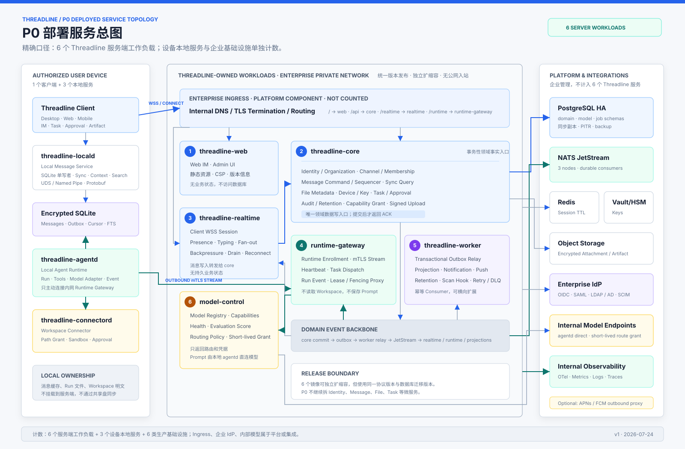
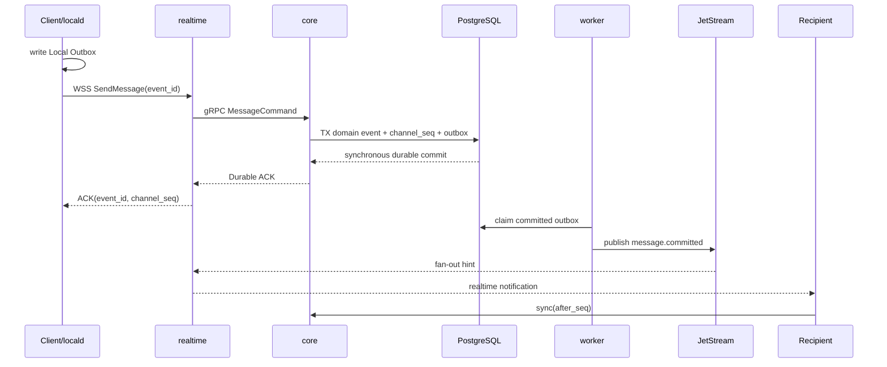
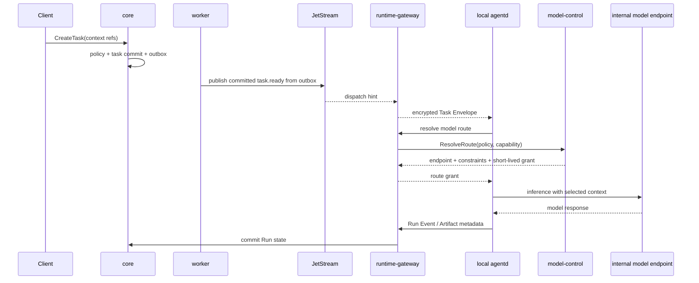

# Threadline P0 部署服务目录

状态：架构评审草案
更新时间：2026-07-24

## 1. 服务数量

明确口径如下：

| 类别 | 数量 | 是否属于 Threadline 服务端发版 | 内容 |
| --- | ---: | --- | --- |
| Threadline 服务端工作负载 | **6** | 是 | web、core、realtime、runtime-gateway、worker、model-control |
| 用户设备本地服务 | **3** | 属于客户端发版 | locald、agentd、connectord |
| 生产基础设施 | **6 类** | 否，企业提供或随私有化方案交付 | PostgreSQL、NATS、Redis、对象存储、Vault/HSM、Observability |
| 企业集成 | 2 类必选 + 可选项 | 否 | 企业 IdP、内部模型；APNs/FCM 是可选受控出网 |

`Threadline Client` 是桌面、Web 或移动客户端，不计入服务；企业 Ingress 是平台组件，也不计入
6 个 Threadline 服务端工作负载。

## 2. 总体服务架构

[SVG](./assets/threadline-p0-deployed-services.svg) · [PNG](./assets/threadline-p0-deployed-services.png)

### 为什么是 6 个

- Realtime 长连接的资源模型与普通 API 不同，需要独立扩缩容和优雅摘流。
- Local Runtime 长连接与 Run Event 可能突发，必须与人类聊天主链路隔离。
- Outbox、通知、保留和扫描是异步任务，故障时不能拖住消息 Commit。
- Model Discovery / Evaluation / Routing 迭代频率不同，而且涉及独立的模型出网策略。
- Identity、Channel、Message、File、Task、Approval 等事务性领域先留在 Core，避免 P0 引入分布式事务。
- Web 静态资源单独发版，便于私有化环境缓存、CSP 和前后端独立回滚。

## 3. 服务端工作负载

### 3.1 `threadline-web`

| 项目 | 定义 |
| --- | --- |
| 部署 | 无状态 Deployment，生产至少 2 副本 |
| 职责 | 提供 Web IM、管理后台、静态资源、CSP、安全 Header 和前端版本信息 |
| 入站 | 企业 Ingress 的 HTTPS `/` |
| 出站 | 浏览器调用 Core Connect API 和 Realtime WSS；服务本身没有业务出站 |
| 数据 | 不拥有业务数据，不访问 PostgreSQL |
| 故障影响 | Web 无法加载；Desktop/Mobile 与服务端 API 仍可工作 |

`threadline-web` 不做 SSR 业务查询，不持有 Session 真相，不把前端资源与 Core 二进制绑成同一镜像。

### 3.2 `threadline-core`

| 项目 | 定义 |
| --- | --- |
| 部署 | 无状态 Deployment，生产至少 2 副本 |
| 职责 | 所有事务性领域命令与查询、Channel 排序、权限复检、Task/Approval 状态机、Capability Grant |
| 入站 | First-party Connect/Protobuf；服务间 gRPC/mTLS；Realtime 转发的 Message Command |
| 出站 | PostgreSQL、对象存储签名接口、Vault/HSM、企业 IdP Adapter |
| 数据 | 唯一写入 Domain Schema 与 Transactional Outbox 的服务 |
| 故障影响 | 新消息和状态变更暂停；客户端继续写 Local Outbox，历史本地缓存仍可读 |

Core 内部保留明确模块边界：

| Core 模块 | 负责的对象 |
| --- | --- |
| Identity / Organization | Tenant、Actor、Member、Role、Guest、SSO Mapping |
| Channel / Membership | Space、Channel、DM、Membership、Resource ACL |
| Message / Sync | Message Event、Thread、Reaction、`channel_seq`、Device Cursor、Gap Recovery |
| File / Artifact | Blob Metadata、Upload Session、ACL、Attachment / Artifact Link |
| Device / Key | Device Trust、KeyPackage、Group Epoch、Revocation |
| Task / Approval | Task、Context Manifest、Run Attempt、Approval、Lease、Fencing Token |
| Audit / Retention | Audit Event、Retention、Legal Hold、Export Hook |

这些模块不能互相直接修改表；命令通过模块接口执行，跨模块变化在一个 Core 事务中提交。只有出现
独立容量、合规或故障域需求时，才把模块拆成独立服务。

### 3.3 `threadline-realtime`

| 项目 | 定义 |
| --- | --- |
| 部署 | 无状态 Deployment，生产至少 2 副本；按连接数和出站带宽扩容 |
| 职责 | Client WSS、连接鉴权、Presence、Typing、在线 Fan-out、Backpressure、优雅摘流 |
| 入站 | 企业 Ingress 的 WSS `/realtime`；JetStream 已提交领域事件 |
| 出站 | Core gRPC、Redis Session/Presence、客户端 WSS |
| 数据 | 不拥有持久业务数据；Redis 内容全部可丢弃重建 |
| 故障影响 | 在线客户端重连并按 Cursor 补洞；消息事实不会丢失 |

Realtime 不能直接写 Message 表。客户端通过 WSS 发送消息时，Realtime 只做连接级校验和限流，
然后调用 Core；收到 Core 的 Durable ACK 后才向客户端确认。

### 3.4 `threadline-runtime-gateway`

| 项目 | 定义 |
| --- | --- |
| 部署 | 无状态 Deployment，生产至少 2 副本；按 Runtime 长连接和 Event 吞吐扩容 |
| 职责 | Runtime Enrollment、出站 mTLS Stream、Heartbeat、Task Dispatch、Run Event、Lease/Fencing Proxy |
| 入站 | 企业 Ingress 的 mTLS `/runtime`；JetStream Task/Approval Event |
| 出站 | Core gRPC、Model Control gRPC、本地 `agentd` Stream |
| 数据 | 不直接访问 Domain 表，不保存 Workspace、Prompt 或消息明文 |
| 故障影响 | Agent Task 暂停派发；Runtime 重连后恢复，普通 IM 完整可用 |

Runtime Gateway 只传递经过 Core 授权的 Task Envelope。所有 Lease 获取、续租、Approval 和 Run
状态变化必须回到 Core 提交，Gateway 不能成为第二套任务事实源。

### 3.5 `threadline-worker`

| 项目 | 定义 |
| --- | --- |
| 部署 | 无入站 Deployment，生产至少 2 副本；使用 Durable Pull Consumer |
| 职责 | Transactional Outbox Relay、Projection、通知、Push、Retention、扫描 Hook、Retry、DLQ |
| 入站 | PostgreSQL Outbox/Job Claim；JetStream Durable Consumer |
| 出站 | JetStream、对象存储、可选 APNs/FCM Proxy、内部通知与扫描系统 |
| 数据 | 只更新 Outbox Delivery、Job 和自有 Projection Schema；禁止修改 Domain 表 |
| 故障影响 | Fan-out、通知和投影延迟；Core 仍可 Commit，恢复后从 Outbox 重放 |

Worker Consumer 采用 At-least-once；业务 `event_id` 是幂等键。超过重试上限的任务进入 Parking
Stream / DLQ，由管理员查看并重放。

### 3.6 `threadline-model-control`

| 项目 | 定义 |
| --- | --- |
| 部署 | 无状态 API + 单 Leader 评测调度，生产至少 2 副本 |
| 职责 | Model Registry、能力清单、健康探测、定期评测、评分、路由策略和短期 Route Grant |
| 入站 | Runtime Gateway gRPC；管理员 Model Policy API；内部评测结果 |
| 出站 | 内部模型 Discovery/Health Endpoint、Vault/HSM、Model Schema |
| 数据 | 独占 Model Registry、Capability、Evaluation、Score、Route Policy Schema |
| 故障影响 | 不能生成新 Route Grant；已有未过期 Grant 可继续，IM 和正在运行的本地工具不受影响 |

Model Control 不接收、代理或存储用户 Prompt。`agentd` 通过 Runtime Gateway 获取 Endpoint、模型、
参数约束和短期凭据后，直接调用企业内网模型。Strict Local Policy 可以只返回本机模型。

## 4. 设备本地服务

| 本地服务 | 职责 | 本地数据 | 服务端关系 |
| --- | --- | --- | --- |
| `threadline-locald` | SQLite 单写者、IM Sync、Outbox、Context API、Search | 加密消息库、Cursor、FTS | Connect/Protobuf + WSS 访问 Core/Realtime |
| `threadline-agentd` | Agent Runtime、Run、Tools、Model Adapter、Event | Run 目录、Session、临时 Context Bundle | 只主动连接 Runtime Gateway；模型调用直达内网 Endpoint |
| `threadline-connectord` | Workspace 路径授权、Sandbox、文件读写和受保护动作 | Grant、授权目录映射、操作日志 | 只接受本机 Agentd 的 Capability 调用 |

Desktop UI 不直接打开 SQLite，也不直接调用 Workspace。Mobile 和 Web 没有 `agentd` 与
`connectord`，只能发起、审批和观察投递到授权 Desktop Runtime 的 Task。

## 5. 生产基础设施

| 组件 | 用途 | 可靠性要求 | 是否消息事实源 |
| --- | --- | --- | --- |
| PostgreSQL HA | Domain、Outbox、Job、Model Registry | ACK 前同步提交到至少一个 Standby；PITR | **是** |
| NATS JetStream | 领域事件、任务派发、异步 Consumer | 3 节点、3 副本、Durable Consumer | 否，可从 Outbox 重建 |
| Redis | Session Directory、Presence、Rate Limit | HA；数据可过期重建 | 否 |
| S3-compatible Object Storage | 加密 Attachment、Artifact、诊断包 | Checksum、版本、生命周期、备份 | Blob 事实源 |
| Vault / HSM / KMS | Service Credential、Device/Model Grant Key | HA、轮换、审计 | Key 事实源 |
| Internal Observability | OTel、Metric、Log、Trace、Alert | 不记录消息明文与 Prompt | 否 |

企业 IdP 和内部模型是集成系统，不由 Threadline 管理生命周期。所有组件使用企业内网 DNS、私有
CA 和 NetworkPolicy；PostgreSQL、NATS、Redis、Vault 不暴露到 Client Network。

## 6. 服务关系

| 调用方 | 被调用方 | 协议 | 用途 | 失败处理 |
| --- | --- | --- | --- | --- |
| Client / locald | Core | Connect RPC + Protobuf / TLS | Command、历史同步、补洞、Task/Approval | Local Outbox + Retry |
| Client | Realtime | WSS + Protobuf | 消息发送、在线事件、Presence | 重连后 Cursor Sync |
| Realtime | Core | gRPC + Protobuf / mTLS | Message Command、鉴权、Durable ACK | 不自行确认消息 |
| Core | PostgreSQL | PostgreSQL Protocol / TLS | Domain + Outbox 原子提交 | Quorum 不足则不 ACK |
| Core | Object Storage | S3-compatible HTTPS | Upload Session、Blob Metadata | 分块续传 |
| Worker | PostgreSQL | PostgreSQL Protocol / TLS | Claim Outbox/Job、更新 Delivery | Lease + Retry |
| Worker | NATS | NATS Protocol / mTLS | 发布已提交领域事件 | Outbox 保留待重放 |
| NATS | Realtime | Durable/Internal Subscription | 在线 Fan-out 通知 | Client Cursor 补洞 |
| agentd | Runtime Gateway | gRPC Stream / mTLS | Heartbeat、Task、Run Event、Approval | 重连 + Lease/Fencing |
| Runtime Gateway | Core | gRPC / mTLS | Task Claim、Lease、Run 状态提交 | Task 保持 Pending/Interrupted |
| Runtime Gateway | Model Control | gRPC / mTLS | Resolve Route、Capability、短期凭据 | 不启动新的模型调用 |
| agentd | Internal Model Endpoint | 企业模型原生 HTTPS / mTLS | 推理数据路径 | Policy Retry / Fallback |
| 所有服务 | OTel Collector | OTLP / mTLS | Trace、Metric、脱敏 Log | 本地 Buffer，不能阻塞业务 |

### 6.1 消息发送关系

### 6.2 Agent Task 关系

## 7. 数据访问规则

- Core 是 Domain Schema 的唯一 Writer。
- Model Control 是 Model Schema 的唯一 Writer。
- Worker 只拥有 Job / Projection Schema，并以受限 Role Claim Outbox；它不能改 Domain Row。
- Realtime 和 Runtime Gateway 不持有 PostgreSQL Credential。
- Web 不持有任何后端 Service Credential。
- `agentd`、`locald`、`connectord` 使用不同的本机 OS Identity 和最小文件权限。
- Object Key 必须包含 Tenant Scope；签名 URL 同时限制对象、动作、大小、Hash 和过期时间。
- 任何服务查询后都按当前 ACL 复检，不能只相信 Event 建立时的权限。

## 8. 扩容与拆分触发条件

P0 保持 6 个服务端工作负载。只有满足下列条件之一才继续拆 Core：

- Message Command / Sync 的容量显著高于其他领域，需要独立数据库分片和 SLO。
- File Scan / Transform 需要独立安全 Sandbox 或 GPU/CPU 资源池。
- Identity / Audit 受到独立合规团队、数据驻留或发布节奏约束。
- Task Orchestration 的吞吐和故障域开始影响 IM Transaction。

拆分前先通过包级边界、独立 Schema Owner、Protobuf Contract 和负载测试证明收益。不能为了使用
Kubernetes 而把每个领域对象变成一个网络服务。
