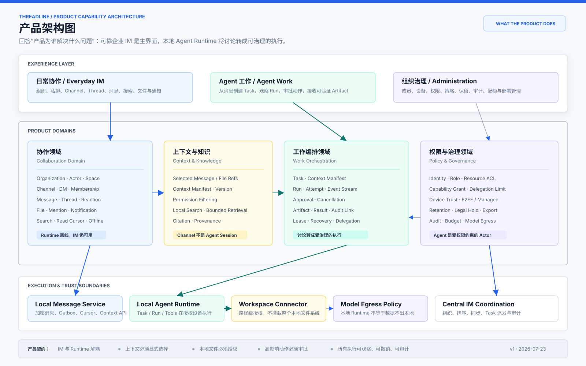
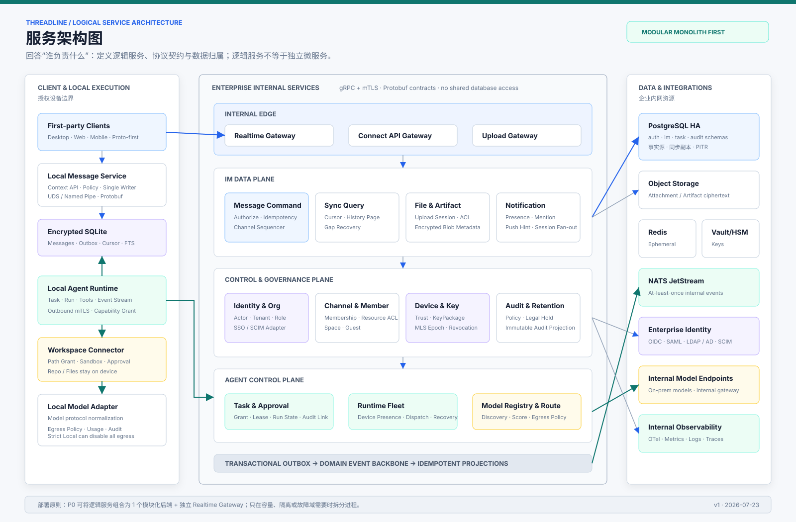
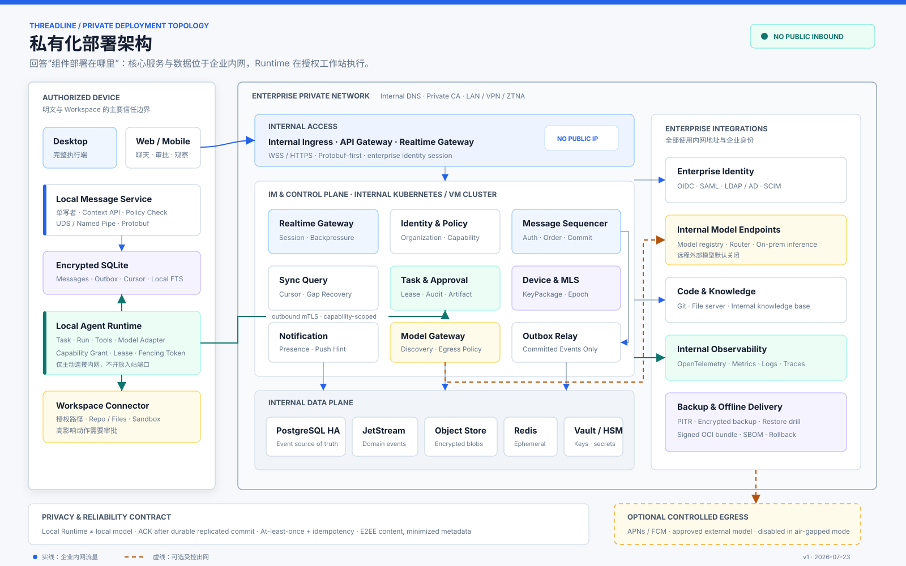
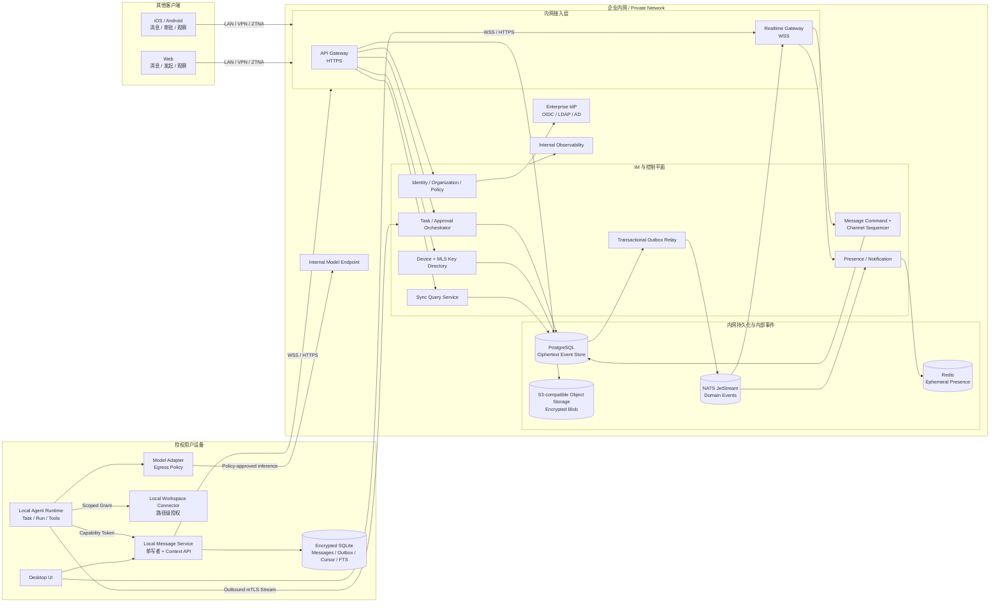
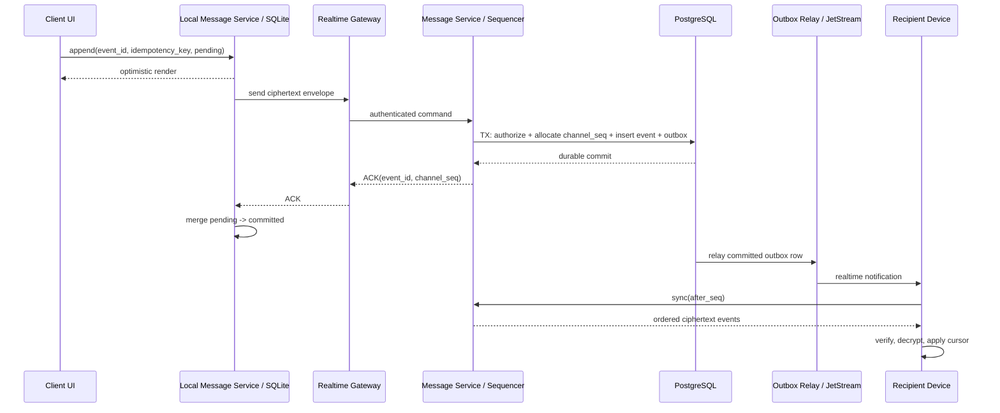
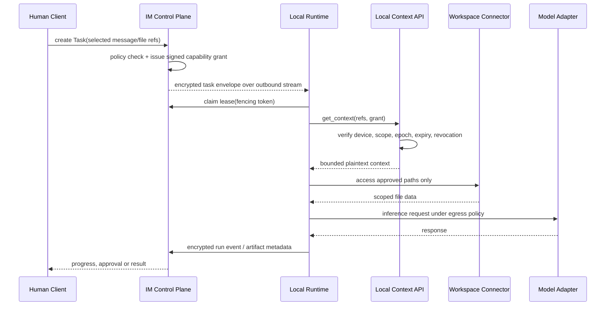

# Threadline 系统架构与通信协议

状态：架构评审草案
更新时间：2026-07-23

## 1. 结论

Threadline 采用 **中心化 IM 协调层 + 设备本地 Agent 执行层**，不是纯 P2P，也不是把 Agent
塞进消息服务：

- 私有化部署是默认基线：所有核心服务、数据组件、模型网关和可观测系统均运行在企业内网。
- IM Server 负责组织、身份、权限、消息排序、离线同步、文件路由和审计。
- Desktop / Mobile 在本地保存加密消息数据库、Outbox、Cursor 和搜索索引。
- Agent Runtime 只运行在用户授权的 Desktop / Workstation；Mobile 和 Web 负责发起、审批与观察。
- Runtime 不直接读取 IM 数据库，只能凭短期 Capability Grant 通过本机 Context API 获取被选中的上下文。
- E2EE Channel 使用 MLS 管理群组密钥；Server 保存密文并负责投递，但不能读取内容。
- Runtime 在本地不等于模型在本地。任何远程模型调用都必须再经过 Model Egress Policy。

现代企业 IM 通常是 Client-Server 架构。中心服务给每个 Conversation / Channel 排序，客户端
保存本地物化视图并通过 Cursor 补洞。Typing、Presence 可以丢；Message、Task、Approval 和
Audit 必须持久化。系统只保证 Channel 内顺序，不追求没有业务意义的全局顺序。

## 2. 三层架构视图

| 层级 | 回答的问题 | 包含内容 | 不包含 |
| --- | --- | --- | --- |
| L1 产品架构 | 产品为谁解决什么问题 | 体验、领域能力、产品契约、执行边界 | 进程、数据库和网络拓扑 |
| L2 服务架构 | 哪个逻辑服务负责什么 | 服务职责、协议契约、数据归属、事件关系 | Pod 数量、节点和物理网络 |
| L3 部署架构 | 组件实际部署在哪里 | 企业内网、设备、集群、数据组件、可选出网 | 产品功能优先级和页面信息架构 |

### 2.1 产品架构



[SVG](./assets/threadline-product-architecture.svg) · [PNG](./assets/threadline-product-architecture.png)

产品架构只表达四个产品领域：协作、上下文与知识、工作编排、权限与治理。它强调 IM 与 Runtime
解耦、Channel 不是 Agent Session、文件访问必须授权，以及 Agent 是受治理的 Actor。

### 2.2 服务架构

#### P0 部署服务总图


[服务目录](./service-catalog.md) · [SVG](./assets/threadline-p0-deployed-services.svg) ·
[PNG](./assets/threadline-p0-deployed-services.png)

P0 精确包含 **6 个 Threadline 服务端工作负载**：`threadline-web`、`threadline-core`、
`threadline-realtime`、`threadline-runtime-gateway`、`threadline-worker` 和
`threadline-model-control`。另外有 3 个设备本地服务和 6 类生产基础设施，它们分别计数。

#### 逻辑服务边界



[SVG](./assets/threadline-service-architecture.svg) · [PNG](./assets/threadline-service-architecture.png)

下图中的方框是 Core 内部逻辑模块，不要求每个方框对应一个进程。当容量、租户隔离或故障域需要
时，再按既有 Protobuf Contract 从 Core 拆分。

### 2.3 私有化部署架构



[SVG](./assets/threadline-private-deployment-architecture.svg) · [PNG](./assets/threadline-private-deployment-architecture.png)

这张图只描述企业设备、内网服务、数据组件和可选受控出网的物理位置。以下 Mermaid 是同一部署
拓扑的文本化维护版本。

### 2.4 逻辑部署拓扑



### 2.5 私有化部署约束

- 不提供公网入站端点。Desktop、Web 和 Mobile 通过企业 LAN、VPN 或 ZTNA 访问内网 Ingress。
- Runtime 主动连接内网 Orchestrator；用户工作站不开放入站端口。
- 所有 Service、PostgreSQL、NATS、Redis、对象存储、Vault/HSM、模型端点和 Observability 使用
  企业内网 DNS 与私有 CA。
- 安装包、OCI Image、Helm Chart、Schema Migration 和模型能力清单支持离线导入，不在运行时访问
  CDN、公共 Registry、遥测 SaaS 或 License SaaS。
- Attachment / Artifact 使用企业自有 S3-compatible Object Storage，例如现有对象存储、MinIO 或
  Ceph；不要求连接公有云 S3。
- 默认不发送产品遥测；诊断包由管理员本地生成、脱敏后显式导出。

### 2.6 信任边界

1. **设备边界**：在 Strict Local / E2EE 模式，消息明文、文件明文、Workspace 和 Prompt 只在授权设备内出现。
2. **企业服务边界**：Server 在 E2EE 模式只持有密文、路由元数据、成员关系和审计元数据；Managed
   Enterprise 模式允许经 Policy 授权的企业服务解密。
3. **Runtime 边界**：Runtime 没有 IM DB 权限，也没有任意文件系统权限；每次读取都带 Grant。
4. **模型边界**：模型是单独的数据接收方。远程推理意味着数据离开设备，必须单独授权。

## 3. 通信协议

| 链路 | 协议 | 负载 | 选择理由 |
| --- | --- | --- | --- |
| Client Realtime | WebSocket over TLS 1.3 | Protobuf Envelope | 浏览器、桌面和移动端兼容；支持双向长连接 |
| First-party Command API | Connect RPC / HTTPS | Protobuf | 第一方客户端共享强类型 Schema 和版本兼容规则 |
| Client Sync API | HTTPS | Protobuf Batch | 历史分页和补洞体积更小，并复用 Realtime Schema |
| Service-to-Service | gRPC over HTTP/2 + mTLS | Protobuf | 强类型契约、流式调用、Deadline 和统一错误码 |
| Local IPC | UDS（macOS/Linux）/ Named Pipe（Windows） | gRPC + Protobuf | 不开放本机 TCP 端口，可依赖 OS ACL |
| Runtime Dispatch | Runtime 主动建立的 mTLS 长连接 | Protobuf Task Envelope | 无需给用户电脑开放入站端口，支持 NAT/企业网络 |
| Attachment / Artifact | HTTPS resumable multipart | 加密二进制块 | 大文件不占用 WebSocket；支持断点续传与校验 |
| External Integration | HTTPS REST | 标准 JSON / Form | OIDC、SCIM、Webhook 遵循外部标准原生格式 |
| Mobile Wake-up（可选） | APNs / FCM | 仅通知和同步提示 | 唯一可选公网依赖；完全隔离模式关闭 |
| Presence / Typing | WebSocket ephemeral event | Protobuf | 允许丢失、合并和过期，不写消息事件表 |
| Voice / Video（后续） | WebRTC | SRTP media | 与消息主链路隔离，不进入 P0 |

不建议第一版把 WebTransport / QUIC 作为默认客户端协议。WebSocket 的企业代理兼容性和实现
成熟度更适合 P0；协议 Envelope 保留 `protocol_version`，将来可以增加 WebTransport，而不用
改变消息语义。

第一方 API 采用 Proto-first。JSON 只保留在 OIDC、SCIM、Webhook 等外部标准边界，不在内部再
维护一套平行的 Message / Task / Approval 数据模型。

### Realtime Envelope

```proto
message RealtimeEnvelope {
  uint32 protocol_version = 1;
  string tenant_id = 2;
  string device_id = 3;
  string event_id = 4;
  string idempotency_key = 5;
  string channel_id = 6;
  uint64 channel_seq = 7;
  string event_type = 8;
  bytes ciphertext = 9;
  bytes signature = 10;
  uint64 group_epoch = 11;
  int64 client_time_ms = 12;
}
```

Server 分配 `channel_seq`；客户端时间只用于展示和诊断，不参与最终排序。字段只能新增，禁止复用
已经发布的 Protobuf Field Number。

## 4. 消息可靠性

可靠性来自应用协议，不来自 WebSocket：



### 必须遵守的语义

- Client 发送前先写 Durable Outbox；进程崩溃后继续重试。
- Server 只在 Event、`channel_seq` 和 Transactional Outbox 同一事务提交后 ACK。
- 传输和内部 Consumer 统一按 **At-least-once** 设计，所有写操作都必须幂等。
- `event_id + tenant_id` 唯一；`idempotency_key` 保留足够长的去重窗口。
- 每个设备维护 `last_applied_seq`；发现 Gap 时停止推进 Cursor 并请求缺口。
- Push、Realtime Fan-out 或 NATS 故障不丢消息，因为客户端可从 PostgreSQL 事实源补齐。
- Edit / Delete / Reaction 是新 Event，不原地覆盖历史事实。
- 一个 Channel 同时只有一个逻辑 Sequencer；超大 Channel 再按 Channel 分片，不做全局锁。

初期可以在 PostgreSQL 事务内锁定 `channel_counter` 行并分配 Sequence。出现持续热点 Channel
后，再把 Sequencer 按 `hash(tenant_id, channel_id)` 分区；协议和客户端无需变化。

## 5. 本地 Agent 与隐私



### Agent 的三种数据模式

| Channel 策略 | Runtime 位置 | 允许的模型 | Server 能否读消息 |
| --- | --- | --- | --- |
| Strict Local | 用户授权工作站 | 本地模型或企业内网模型 | 否 |
| E2EE + Approved Egress | 用户授权工作站 | 明确批准的企业模型 Endpoint | 否；模型 Endpoint 会收到被批准的片段 |
| Managed Enterprise | 本地或企业 Runner | 企业策略允许的模型 | 企业 KMS 可解密 |

必须在 Task UI 和 Audit 中展示：运行设备、模型 Endpoint、将发送的数据类别、工具权限和有效期。
不能因为 Runtime 在本机，就把远程模型调用描述成“数据不出本地”。

### 本地存储

- Desktop / Mobile 使用整库加密 SQLite；密钥放入 Keychain、Android Keystore 或 Windows DPAPI。
- Local Message Service 是唯一 Writer；UI、Search Worker 和 Runtime 不直接打开数据库写入。
- SQLite 使用 WAL，Reader 通过 Snapshot 并发读取；应用控制 Checkpoint 并处理 `SQLITE_BUSY`。
- 生产环境最低使用 SQLite `3.51.3`，或带 WAL Reset 修复的 `3.50.7` / `3.44.6` 回移版本。
- SQLite 文件、WAL 和 SHM 只能放本机文件系统，不能放 S3、NFS 或同步盘。
- S3 / Object Storage 保存的是独立加密 Blob，不是正在写入的数据库文件。

### Web 与 Mobile 的限制

- Web 可完成聊天、任务发起、审批和观察，但不直接获得任意本地文件权限。
- Browser 不直接访问 `localhost` Runtime；Task 先进入控制平面，再由 Runtime 的出站连接领取。
- Web 使用 IndexedDB / OPFS 作为受限缓存；不把浏览器存储视为可替代 Desktop 加密 SQLite 的长期保险库。
- iOS / Android 不保证长时间后台进程，因此 Mobile 不是 P0 Agent Worker。
- Mobile 发起的 Task 默认投递到用户选定的在线 Desktop Runtime；离线时排队并显示目标设备状态。
- E2EE Task 的 Context Bundle 由授权客户端加密给目标 Runtime，Server 只转发 Ciphertext。

## 6. E2EE 与密钥管理

E2EE Channel 使用 RFC 9420 MLS，而不是自研群组加密：

- Organization Identity Service 签发并验证设备身份；Device Directory 发布 MLS KeyPackage。
- 每个 Channel 对应一个 MLS Group；加入、移除 Device 或 Agent Device 都产生新 Epoch。
- Server 是 Delivery Service，只保存 MLS Message、Ciphertext Attachment 和必要路由元数据。
- Attachment 使用随机 Content Key 分块加密；Content Key 经当前 MLS Epoch 安全分发。
- 设备私钥只存在 OS Secure Storage；换机和恢复必须走显式的设备授权流程。
- Agent Runtime 若要读取 E2EE Channel，必须作为可见 Device 加入，或只接收一次性加密 Context Bundle。

E2EE 不隐藏所有元数据。Server 仍可能看到 Tenant、Channel 路由标识、设备、时间、消息长度、IP
和流量频率。隐私承诺必须准确写成“内容端到端加密”，并单独定义 Metadata 最小化和保留周期。
端点被解锁、被恶意软件控制，或用户已经导出明文时，E2EE 也不能追回数据；本地加密主要保护
设备丢失和静态磁盘泄漏。

企业合规还需要 Managed Encryption 模式。Legal Hold、Server Search 和 DLP 与严格 E2EE 存在
真实冲突，必须由 Organization Policy 按 Space / Channel 选择，不能同时承诺两者完整成立。

## 7. 服务端数据与事件

### 两种私有化档位

| 档位 | 网络条件 | 模型 | Mobile 后台通知 |
| --- | --- | --- | --- |
| Standard Private | 核心服务全内网；仅允许白名单出站 Proxy | 企业内网模型；可审批外部模型 | 可选 APNs / FCM |
| Air-gapped | 无公网入站且无公网出站 | 本地或企业内网模型 | 关闭；应用打开或恢复内网连接后同步 |

APNs / FCM 由操作系统厂商控制，无法在企业内网自行部署。完全隔离环境仍可正常聊天和补洞，但
iOS / Android 应用被系统挂起后不能承诺实时后台唤醒。这个限制必须写进交付说明，不能伪装成
“全内网推送”。

### PostgreSQL 是消息事实源

- `events` 按 Tenant 和时间分区，唯一约束覆盖 `tenant_id + event_id` 与
  `channel_id + channel_seq`。
- Message、Membership、Task、Approval 和 Audit 使用显式 Event / State 表，不共享隐式 JSON。
- 同区域 Multi-AZ；消息 ACK 前同步提交到至少一个 Standby。Quorum 不足时停止 ACK，不能用可用性
  换取“显示已发送但故障后消失”。
- 开启持续归档和 PITR；定期做可恢复性演练，而不只检查备份存在。
- 单个 Tenant 设置配额、限流和可选的数据驻留 Region。

### NATS JetStream 是内部事件层

NATS 用于 Fan-out、Push、索引、审计投影和 Agent 调度通知。它不替代 PostgreSQL 消息事实源：

- PostgreSQL Transactional Outbox Relay 发布 Commit 后的领域事件。
- Consumer 使用 Durable Pull Consumer、显式 ACK、Backoff 和 Dead-letter / Parking Stream。
- Consumer 以业务 Event ID 幂等；不要依赖宣传意义上的 Exactly-once。
- NATS 集群不可用时消息仍可 Commit；恢复后 Outbox 继续 Relay。

Presence 和 Typing 可以走 Core NATS / Redis TTL，因为它们允许丢失。Task、Approval 和 Audit 必须
走 JetStream 或直接从 PostgreSQL Outbox 重放。

## 8. 可用性与故障策略

| 故障 | 用户可见行为 | 恢复方式 |
| --- | --- | --- |
| WebSocket 断开 | 显示离线；发送保留为 Pending | 指数退避 + Jitter 重连，随后 Cursor 补洞 |
| Realtime Gateway 重启 | 短暂重连，不丢历史 | Gateway 无状态；重新鉴权和同步 |
| NATS 暂停 | 在线通知延迟 | PostgreSQL Outbox 积压并在恢复后重放 |
| PostgreSQL Primary 故障 | 暂停发送确认，客户端继续写 Outbox | Multi-AZ Failover；禁止假 ACK |
| Object Storage 故障 | 文本消息正常，文件上传重试 | 分块续传、Checksum、上传状态机 |
| Local Runtime 离线 | IM 完整可用；Task 排队或改派 | Device Presence + Lease 超时 |
| Runtime 执行中崩溃 | Run 标记 interrupted | 新 Attempt 获取更高 Fencing Token 后恢复 |
| 权限被撤销 | 后续 Context / Tool 调用立即拒绝 | 短 TTL Grant + Revocation Push + 服务端复检 |
| Key 丢失 | 该设备不能解密历史 | 设备恢复流程；Server 不能绕过 E2EE 恢复明文 |

### 起始 SLO

- IM API / Sync 月可用性：`99.95%`；Runtime 不计入 IM 可用性。
- 同区域消息 Commit：p95 `< 300 ms`；在线投递：p95 `< 1 s`。
- 服务端消息：RPO `< 5 min`、RTO `< 60 min`；目标应在演练后再收紧。
- 任何 ACK 后丢失消息属于 Sev-1；重复事件由幂等合并，不算数据丢失。
- 每季度执行数据库恢复、Region 失联、NATS 积压和 Runtime Lease 冲突演练。

### 部署基线

- Stateless Service 至少 2 个副本，跨可用区调度，配置 PDB、Readiness 和优雅下线。
- PostgreSQL 优先接入企业已有 HA 数据库服务；否则交付一套经过版本锁定和恢复验证的 HA 方案。
- NATS JetStream 使用 3 节点、3 副本 Stream；消息事实源仍是 PostgreSQL。
- Object Storage 开启版本、生命周期、Checksum 和租户前缀隔离。
- OpenTelemetry 统一 Trace、Metric 和结构化 Log；日志严禁记录消息明文和 Prompt。
- Secret 进入企业 Vault / HSM / KMS；禁止把生产凭据固化在 Helm Values 或环境变量模板。
- 发布物包含离线 OCI Bundle、SBOM、签名、校验文件、数据库迁移和可回滚升级说明。
- 第一阶段单 Region 写入；不要一开始做跨 Region Active-Active Channel Sequencer。

## 9. 建议的第一阶段实现边界

1. 一个可部署单元内实现 Identity、Channel、Message、Sync、Task 和 Approval 模块，保持代码边界，
   不急于拆成大量微服务。
2. PostgreSQL + Transactional Outbox 作为事实源，NATS JetStream 承载异步投影与调度。
3. Desktop 实现 Local Message Service、Encrypted SQLite、Local Connector 和 Runtime 出站连接。
4. Web / Mobile 先实现 IM、发起、审批和观察；Agent 长任务固定派发到 Desktop Runtime。
5. 先交付 Managed Encryption，再以独立安全评审引入 MLS E2EE；不要自研加密协议。
6. 在协议仓库维护 `.proto`、兼容性测试、Golden Frame 和升级策略。
7. 在正式编码前补齐 Threat Model、Data Classification、Key Recovery 和 Incident Runbook。

初期推荐模块化单体，不推荐一开始拆十几个服务。上述图是逻辑边界；Identity、Message、Sync、
Task 和 Approval 可以先部署在同一个后端进程中，但必须只能通过模块 API / Event Contract 交互，
为后续热点模块单独扩容保留边界。

## 10. 设计依据

- [RFC 6455: The WebSocket Protocol](https://www.rfc-editor.org/info/rfc6455/)
- [RFC 9420: Messaging Layer Security](https://www.rfc-editor.org/info/rfc9420/)
- [gRPC Introduction](https://grpc.io/docs/what-is-grpc/introduction/)
- [SQLite Write-Ahead Logging](https://sqlite.org/wal.html)
- [PostgreSQL High Availability and Replication](https://www.postgresql.org/docs/current/high-availability.html)
- [NATS JetStream Consumers](https://docs.nats.io/nats-concepts/jetstream/consumers)
- [Firebase Cloud Messaging receive semantics](https://firebase.google.com/docs/cloud-messaging/android/receive-messages)

这些标准和组件提供传输、存储与密钥协议，但不能代替 Threadline 自己的权限模型、幂等语义、
Cursor 恢复、威胁模型和运维演练。
