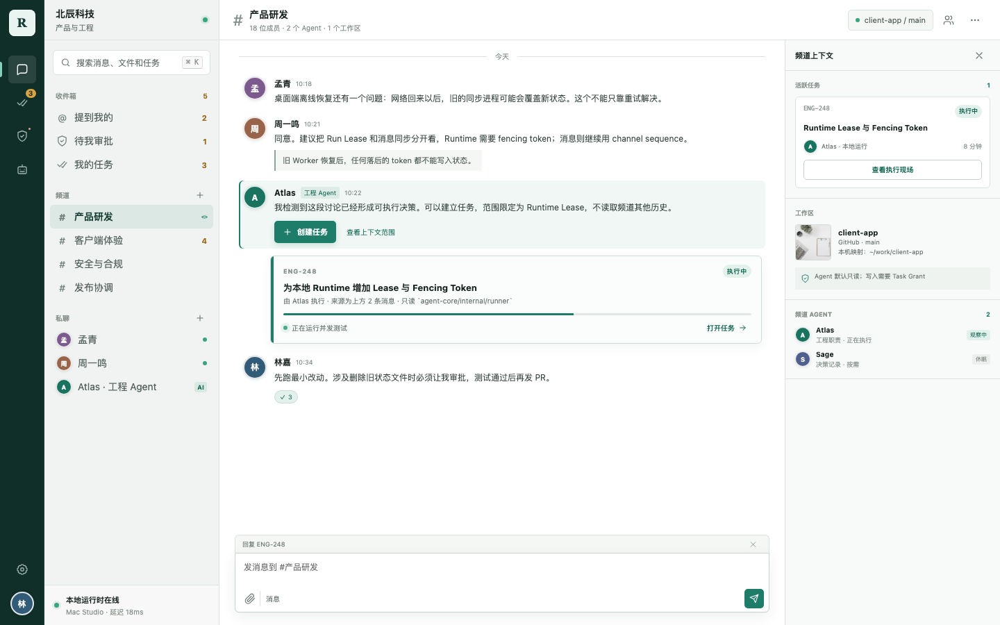
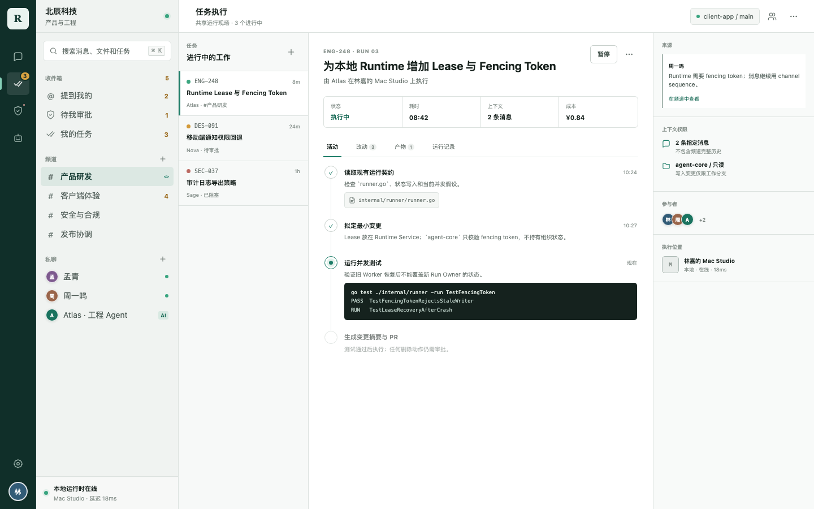
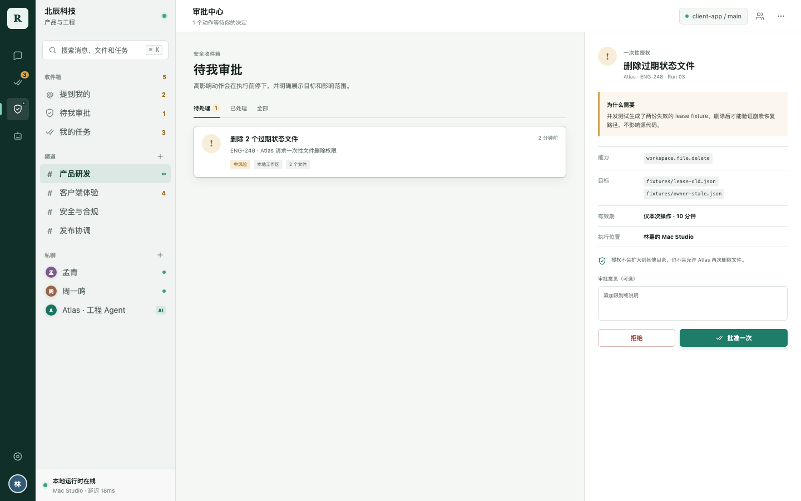
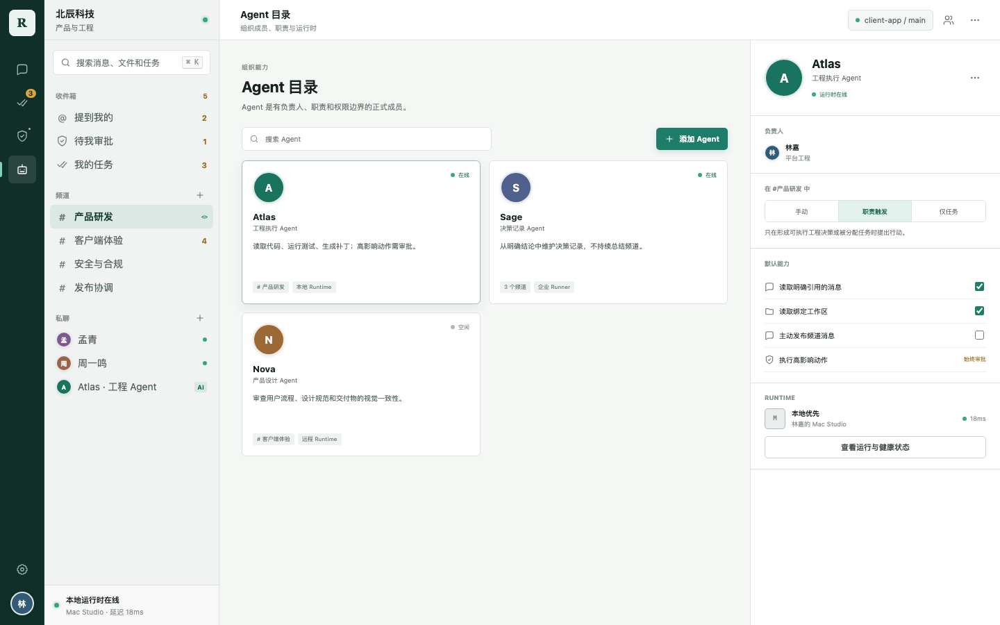
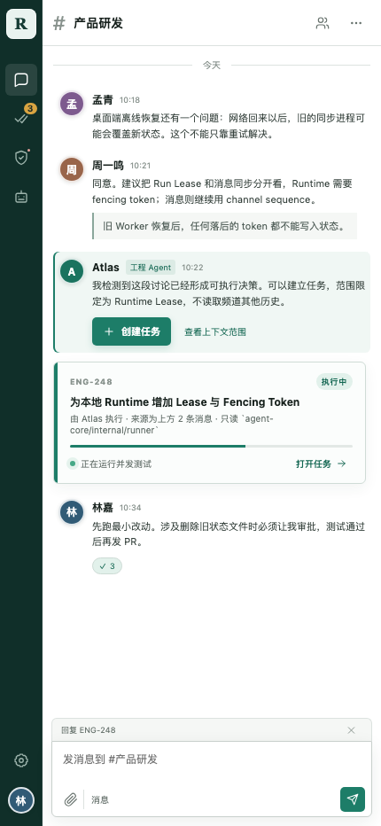
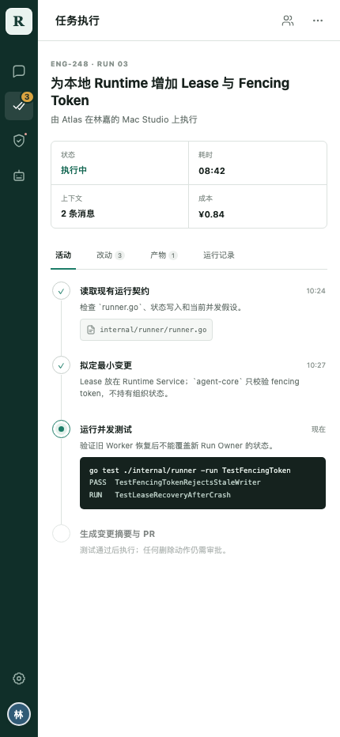

# Agent 原生企业 IM 产品需求文档

状态：M0 范围冻结版 0.5（含完整可交互原型）
日期：2026-07-24

产品原型：[进入 Threadline 统一原型](./prototype/index.html)

v1 范围基线：[Private Enterprise v1.0 Scope Freeze](./acceptance/scope.md)

原型覆盖工作空间、收件箱、频道协作、全局搜索、文件与产物、Agent 任务执行、风险审批、
任务交付、Agent 目录、Runtime 设备、同步恢复、组织管理，以及桌面端和移动端响应式布局。
原型用于验证产品交互和信息层级，不代表最终品牌命名与视觉资产。

## 1. 产品定义

开发一套完整、可独立运行的企业级 IM，同时让 Agent 成为受权限约束的正式协作者。

系统由两个独立基础组成：

```text
企业 IM = 组织 + 身份 + 消息 + 文件 + 权限 + 审计
Agent Runtime = Run + 工具 + Workspace + 审批 + 产物 + 记忆
```

Runtime 使用项目自有的 `agent-core`。Hermes Agent 只作为设计参考，重点借鉴其 Agent
Loop、工具调用、Session 恢复、记忆、Subagent、定时任务和异步结果投递，不作为生产依赖。

产品承诺：

> 团队在一个正常、可靠的企业 IM 中沟通；任何一段对话都可以直接转化为有权限、可观察、
> 可多人协作的执行任务，不需要把工作搬到另一个 AI 聊天产品。

## 2. 核心原则

1. **IM 可以独立成立。** 模型或 Runtime 全部离线时，人仍可正常聊天、传文件和搜索。
2. **Agent 是 Actor，不是机器人插件。** Agent 有身份、成员关系、职责、权限、预算和审计记录。
3. **Channel 不等于 Agent Session。** Channel 承载长期沟通和多个 Task；每个 Task 可产生一个或多个 Run。
4. **消息不是 Prompt。** 原始消息保存在 IM；Runtime 只按引用和权限获取任务需要的上下文。
5. **Runtime 不能绕过 IM 权限。** 每次执行只能使用范围明确、短期有效的 Capability Grant。
6. **执行过程可观察。** 团队可以看到状态、工具活动、审批、产物、成本和责任人，而不必阅读原始日志。
7. **本地能力必须显式授权。** 访问成员本地文件只能通过 Local Connector，并有可见的授权边界。
8. **消息正文默认 E2EE。** IM 服务端只保存密文；企业恢复必须与应用服务隔离并经过多人审批。
9. **模型不旁听普通消息。** 只有 Task、消息转任务和明确规则才能触发 Agent 获取有限上下文。

## 3. 产品目标与非目标

### 3.1 产品目标

- 提供私聊、群聊、频道、Thread、文件、搜索、通知和多端同步。
- 支持企业组织、部门、角色、访客、频道成员、数据保留和审计。
- Agent 通过 Task、消息转任务和明确规则参与，不强制依赖 `@Agent`，也不监听每条消息调用模型。
- 将一条消息或一段讨论转成绑定文件、仓库、工具、审批和 Runtime Run 的 Task。
- 多个人可以观察、评论、批准、中断、恢复或显式转交同一个 Agent Task。
- 提供可在企业内网独立安装、升级、备份和运维的单 Region 私有化部署。

### 3.2 非目标

- 不负责替企业部署基础模型。
- 不把每条消息都发送给 LLM。
- 不默认让 Agent 读取整个企业的历史消息。
- 不替代 Git、对象存储、企业文档系统或身份提供商。
- 不使用 `agent-core` 的 Session 文件作为 IM 消息数据库。
- 音视频不进入初始核心架构，后续可挂接在相同组织与频道模型下。

## 4. 目标用户

| 角色 | 核心需求 |
| --- | --- |
| 普通员工 | 快速、可靠地沟通，并可把工作交给 Agent 执行 |
| 团队负责人 | 将工作分配给人或 Agent，看到进度、风险和阻塞 |
| 操作审批人 | 审批高风险动作，检查 Runtime 实际做了什么 |
| Agent 负责人 | 配置 Agent 职责、工具、模型路由、预算和权限范围 |
| IT 管理员 | 管理身份、设备、部署、保留策略和企业集成 |
| 安全管理员 | 制定策略、审查日志、撤销权限和导出审计证据 |
| 访客/外包 | 只进入明确共享的 Space、Channel 和资源 |

## 5. 核心领域模型

```text
Organization
  +-- Member (Human | Agent | Service)
  +-- Space
       +-- Channel
            +-- Message
            +-- Thread
            +-- WorkspaceBinding
            +-- Task
                 +-- Participant
                 +-- ContextManifest
                 +-- Run
                      +-- Step
                      +-- Event
                      +-- Approval
                      +-- Artifact
```

### 5.1 核心对象

| 对象 | 用途 |
| --- | --- |
| Organization | 企业身份、策略和数据隔离边界 |
| Actor | Human、Agent、Service 的统一身份抽象 |
| Space | 部门、项目或跨部门协作边界 |
| Channel | 具有成员和策略的长期沟通空间 |
| Thread | Channel 内聚焦某一问题的讨论 |
| Message | 基础消息事件，关联编辑、回复、Reaction 和附件 |
| WorkspaceBinding | 仓库、文档集合、企业文件位置的逻辑引用 |
| Task | 从沟通产生或主动创建的协作工作单元 |
| ContextManifest | Task 使用的版本化上下文引用，不复制整个聊天历史 |
| Run | Task 的一次 `agent-core` 执行尝试 |
| Approval | Runtime 执行受保护动作前的人类决策 |
| Artifact | Patch、文档、报告、图片或构建结果等运行产物 |

### 5.2 必须保持的关系

```text
Channel 1 -> N Task
Task    1 -> N Run
Run     1 -> N RuntimeEvent
Task    N -> N Actor
Channel N -> N WorkspaceBinding
```

一个 Task 重试时创建新 Run，不覆盖失败 Run。Channel 中的人类消息也不能直接写进
`agent-core` Session。

## 6. 产品信息架构

### 6.1 全局导航

- **收件箱：** @我、回复、审批、分配给我的 Task、重要状态变化。
- **私聊：** 人与人、人与 Agent、小群聊。
- **Space / Channel：** 企业协作层级。
- **任务：** 我的任务、关注中、运行中、待审批、阻塞、已完成。
- **文件与产物：** 有权访问的共享文件和 Runtime Artifact。
- **搜索：** 消息、成员、Channel、Task、决策、文件和产物。
- **Agent 目录：** 可用 Agent、职责、健康状态、所属团队和权限。
- **管理后台：** 组织、身份、策略、数据保留、审计和 Runtime Fleet。

### 6.2 屏幕级原型

这套原型不是独立的“AI 控制台”。它从正常企业 IM 出发，让 Agent、Task、Run、Approval 和
Local Runtime 进入同一套协作界面。

#### 产品原型总览

统一原型通过 URL 路由覆盖沟通与发现、从讨论到交付、能力与治理三条核心流程。桌面端和移动端
共用一个入口，窄视口自动进入移动交互。

| 原型页面 | 需要验证的产品决策 |
| --- | --- |
| Channel | Agent 作为频道成员自然参与，但不能抢占人类聊天主界面 |
| Inbox | 提及、回复、审批和任务变化进入同一个可处理收件箱 |
| Search | 消息、文件、任务和成员统一检索，返回结果前重新校验权限 |
| Files | 频道附件、工作区文档和 Agent Artifact 使用同一权限表达 |
| Task Run | 运行过程进入共享执行现场，命令日志不刷屏到 Channel |
| Approval | 授权前明确展示能力、目标、有效期、执行位置和影响范围 |
| Task Delivery | 人工审查 Diff、测试和产物后，才接受结果或创建 PR |
| Agent Directory | Agent 必须具备负责人、职责模式、默认能力和 Runtime 状态 |
| Runtime | 展示授权 Desktop Runtime、Local Connector、路径授权和健康状态 |
| Sync | 展示设备 Cursor、Outbox、Gap Recovery 和加密本地缓存 |
| Organization Admin | 企业、Space、Channel、加密模式、设备策略与审计治理 |
| Mobile | 手机端保留消息、任务观察和审批，长任务执行交给授权 Desktop Runtime |

#### Channel：人类沟通是主界面



频道时间线只投影 Agent 的提议、关键状态和结果。完整 Tool Activity、成本、文件改动和重试
进入 Task 页面。右侧上下文栏可折叠，用于查看活跃 Task、WorkspaceBinding 和当前可用的 Agent
及其触发策略。

#### Task Run：共享执行现场



Task 页面把来源消息、Context Grant、Runtime 位置、执行活动和产物放在同一个可审查界面中。
团队成员观察的是结构化活动，不需要阅读 Runtime 原始日志。

#### Approval：能力范围先于批准按钮



审批不是普通聊天确认。界面必须先说明 Runtime 请求了什么 Capability、操作哪些具体资源、
授权多久、在哪台设备执行，以及授权不会覆盖哪些范围。

#### Agent Directory：正式成员而非机器人插件



Agent 目录统一展示 Owner、Channel Participation Mode、Default Capability、Runtime Location
与 Health。将 Agent 加入频道时，企业管理员应先看到这些边界。

#### 移动端：沟通、观察和批准





移动端不复制桌面端三栏布局。它保留完整消息时间线和 Run 关键活动，用于发起、观察、中断与
审批；本地文件执行只调度到用户已授权且在线的 Desktop Runtime。Enterprise Runner 不属于 v1。

### 6.3 Channel 页面结构

Channel 首先必须是一个熟悉的 IM，不默认做成任务 Dashboard：

```text
+------------------------------------------------------------------+
| Channel 名称 | Topic | 成员 | Workspace | Agent Policy           |
+----------------+--------------------------------+----------------+
| Channel 列表   | 消息时间线                     | 上下文侧栏     |
|                | - 人类消息                     | - 活跃 Task    |
|                | - Agent 消息                   | - 文件         |
|                | - Task 状态                    | - 决策         |
|                | - 审批请求                     | - 成员         |
|                | - Artifact                     | - Agent        |
|                +--------------------------------+----------------+
|                | Composer：发消息 / 建 Task / 关联资源            |
+----------------+-------------------------------------------------+
```

右侧上下文栏可折叠，只展示协作状态，不挤压正常聊天区域。

### 6.4 Task 页面结构

Task 是共享执行现场，不是另一个无限聊天窗口：

- 目标、负责人、参与者、优先级、状态和来源消息。
- 当前计划和正在执行的 Run。
- 人类评论与 Agent 关键更新。
- 结构化 Tool Activity，而不是大量命令日志刷屏。
- 待审批动作、影响范围和请求的 Capability。
- Workspace、分支、文件和执行环境。
- Diff、Artifact 和最终交付结果。
- Usage、Cost、耗时和失败原因。
- 中断、重试、Fork、移交、批准、拒绝和归档。

## 7. 功能需求

### 7.1 组织与身份

- 创建、配置、冻结和删除企业组织。
- 邀请、停用、恢复成员，支持部门和团队层级。
- Human、Agent、Service、Admin、Guest Actor 类型。
- v1 支持企业 OIDC、管理员邀请和 CSV 成员导入；SAML SSO、SCIM Provisioning 和完整目录同步
  属于后续版本。
- 多设备登录、Session 撤销、MFA 策略和设备清单。
- Agent 身份必须展示 Owner、Runtime、职责、当前健康状态和最近活动。

### 7.2 消息系统

- 私聊、小群、公开/私有 Channel 和 Thread。
- 文本、代码、链接、Mention、Emoji、附件、回复、Reaction 和 Pin。
- 每台设备维护加密的本地消息数据库和同步 Cursor；只缓存该用户有权访问且符合设备
  Retention Policy 的消息，不自动下载整个企业历史。
- 本地消息表默认保存 Channel Ciphertext Payload；只有展示、搜索或构造 Task Context 时
  才在 Local Message Service 内解密。
- 客户端同步逻辑 Message Event，不在设备之间复制 SQLite 数据库文件。
- 消息编辑、删除、撤回策略，以及不可变的审计表达。
- Channel 内有序，发送使用客户端 Idempotency Key 防止重复。
- 离线 Outbox、断线重连、缺口修复和多端 Read Cursor 同步。
- 草稿、定时发送、Mute、通知级别和免打扰时段。
- Presence 和 Typing 为短期状态，故障时不影响消息主链路。
- 历史消息分页获取，并在每次读取时重新校验权限。

### 7.3 文件与搜索

- 分片上传、断点续传、预览、Checksum 和病毒扫描 Hook。
- 附件使用独立随机 Content Key 分块加密；服务端对象存储只接收密文 Blob。
- 文件默认继承 Channel 权限，也可以进一步收窄。
- v1 Content Search 只在授权设备的加密 SQLite 中建立可重建索引；服务端只能按允许暴露的
  Ciphertext Metadata 过滤，不能建立正文索引。
- 病毒扫描在加密前由客户端或企业批准的本地扫描器完成；默认服务端扫描 Hook 不获得文件明文。
- 按成员、Channel、Thread、时间、附件类型、Task 过滤。
- Search 只是可重建索引，不能成为权限判断来源。
- 权限撤销后，未来搜索立即不可见，但不破坏安全审计证据。

### 7.4 Agent 成员

- 像添加成员一样把 Agent 加入或移出 Channel。
- Channel 在 v1 可以配置 Agent 参与模式：
  - `manual`：只有明确委派时运行。
  - `task_only`：只进入被分配的 Task。
  - `paused`：保留成员关系，但不处理事件。
- 普通消息不会自动调用 LLM；Composer Task 模式、消息转任务或明确规则负责触发。v1 自动规则只能
  创建或分配 Task，不授予 Agent 持续读取 Channel 的隐式权限。
- 分开授权读取引用消息、有限历史、起草、发布、创建 Task、调用工具和委派 Agent。
- Channel 必须显示当前有哪些 Agent 可被触发，以及依据哪条策略；这不表示 Agent 持续读取消息。
- 每次 Agent 主动行为都可以查看 Trigger、来源消息和权限依据。

### 7.5 Task 与执行

- 手动创建 Task，或从一条/多条选中消息创建。
- 可分配给 Human、Agent 或混合团队。
- 绑定 Context Reference、逻辑 Workspace、执行设备、截止时间和预期 Artifact。
- 一个 Run 同时只有一个 Execution Owner、设备、Workspace Lease 和 Fencing Token。
- 其他成员可以观察、审批和中断；转交必须选择新的设备和 Workspace，并重新签发 Capability Grant。
- 启动、暂停、中断、重试、Fork 和取消 Runtime Run。
- Runtime Event 流入 Task 页面，不在 Channel 中刷执行细节。
- 只把关键状态变化回写来源 Channel。
- 每次 Run 保留完整历史；重试创建新 Run。
- Human 可随时接管，保留 Agent 已完成工作和 Provenance。

### 7.6 审批

- Runtime 必须说明请求的 Capability、目标资源、原因和预期影响。
- 根据组织、Channel 和资源策略计算审批人。
- 支持单次、Task 范围、时间范围授权和拒绝。
- 审批不能暗中扩大 Runtime 原始请求的权限范围。
- 授权过期或撤销后，后续动作立即失败。
- 记录审批人、时间、意见、策略版本和对应 Run Event。

### 7.7 Workspace 与 Local Connector

- Channel 保存共享协作语境和逻辑资源，不绑定某个成员的物理路径。
- Repo Binding 保存 Remote Repo 和 Branch Policy。
- Run 使用隔离的 Workspace Lease、Branch、Worktree 或 Container。
- 每位用户在每台 Desktop 上独立将本地仓库映射到逻辑 WorkspaceBinding；路径不上报 Server。
- 本地访问只允许明确 Path Scope 和有效授权时段。
- Connector 不能把整个文件系统 Root 暴露给 Server 或 Agent。
- v1 Task 只能调度到已注册并授权的 Desktop Runtime；Remote Enterprise Runner 属于后续版本。
- 目标 Desktop 离线时 Run 进入等待，不自动漂移到其他设备或服务端执行。

## 8. 权限模型

组织默认权限使用 RBAC，具体资源访问使用关系与 Capability 校验。

```text
Runtime 有效权限 =
  Organization Policy
  intersection Channel Membership
  intersection Actor Role
  intersection Task Grant
  intersection Resource ACL
  intersection Initiator Delegation Limit
```

基础 Capability：

```text
message.read
message.read_history
message.publish
message.publish_draft
file.read
file.write
workspace.read
workspace.write
tool.invoke
action.execute
agent.delegate
memory.retain
task.approve
audit.read
```

要求：

- 默认拒绝。
- Capability Token 必须包含 Tenant、Task、Actor、Resource、Expiry。
- Runtime 只拿短期 Capability Token，不拿用户长期凭证。
- 权限变更立即影响下一次读取和动作。
- Agent Memory 的保留时间不能超过来源内容的保留和访问策略。
- Guest 权限不能隐式扩展到企业内部 Agent Memory。

## 9. 上下文设计

普通 Channel 不持续调用 LLM 总结。Server 保存有序 Ciphertext Event，授权设备保存本地物化视图
和可重建索引；Task 只生成一个 `ContextManifest`：

```json
{
  "taskId": "task_123",
  "triggerMessageId": "msg_987",
  "messageRefs": ["msg_980", "msg_981", "msg_987"],
  "threadRefs": ["thread_42"],
  "fileRefs": ["file_18"],
  "workspaceRefs": ["repo_client"],
  "createdBy": "user_12",
  "policyVersion": "policy_7"
}
```

Runtime 通过受权限控制的工具按需获取内容：

```text
search_messages(query, channel, time_range, actors)
get_message_context(message_id, before, after)
get_thread(thread_id)
get_attachment(file_id)
get_task(task_id)
get_workspace_manifest(workspace_id)
```

本地 Runtime 通过 Local Message Service 解密被授权的引用并组装 Prompt。Prompt 只包含当前 Task、
选中的引用和工具，不包含完整 Channel Transcript，也不经过 IM Server 或 Model Control。

Model Control 只提供模型发现、能力、健康、评测、评分和短期路由授权。Runtime 在本机按数据策略
选择已批准 Endpoint 并直接调用；该 Endpoint 是独立的 Prompt 明文信任边界。一个 Run 固定模型和
版本，Fallback 只能使用预先批准的候选，用户可以覆盖自动路由。

## 10. 与现有 `agent-core` 的关系

当前 `agent-core` 已经具备有价值的执行契约，但还不是 Hermes 那种完整交互式 Runtime：

| 能力 | 当前状态 |
| --- | --- |
| Run / Step Spec | 已实现 |
| Status Snapshot | 已实现 |
| Append-only Event | 已实现 |
| 文件审批暂停 | 已实现 |
| Artifact 收集 | 已实现 |
| Usage / Cost Ledger | 已实现 |
| 通用 Subprocess 执行 | 已实现 |
| 文件 Session | 只有最小 Append Store |
| Cancellation | 未实现 |
| 交互式多轮 Agent Loop | 未实现 |
| Runtime Service API | 未实现 |
| Capability Token Enforcement | 未实现 |
| 并发写 Lock | 未实现 |
| Tenant Isolation | 应由 Orchestrator 管理，不放进 Runtime |

继续保持现有边界：

```text
agent-core = 如何执行
workflow   = 执行什么
IM         = 谁在沟通、谁可以行动、工作如何呈现
```

### 10.1 Runtime Control Contract

IM Orchestrator 最终通过与 Transport 无关的接口控制 `agent-core`：

```text
CreateRun(task, spec, workspaceLease, capabilityGrant)
GetRun(runId)
StreamRunEvents(runId, afterEventId)
SubmitApproval(runId, approval)
CancelRun(runId)
AppendTaskInput(runId, inputRefs)
ListArtifacts(runId)
```

Runtime Workspace 内仍可使用当前文件契约作为事实来源。Runtime Service 负责把 API 调用
转成 `spec.json`、Approval Record、Cancellation Marker 和 Event/Status Stream。

### 10.2 Runtime Event 到 IM 的投影

| `agent-core` Event | IM 展示 |
| --- | --- |
| `run_started` | Task Run 已启动 |
| `step_started` | 当前执行活动变化 |
| `approval_required` | Inbox 和 Task 中出现审批项 |
| `artifact_created` | Artifact 挂到 Task |
| `step_failed` | 可重试的结构化失败 |
| `run_completed` | Task 结果可审查 |
| `run_failed` | 本次 Run 失败，Task 仍保留 |

Runtime Event 不是普通聊天消息。客户端应分别渲染为状态、审批、活动或 Artifact。

## 11. 本地优先存储、加密同步与并发

### 11.1 推荐拓扑

产品采用 Local-first Client + Central Coordination，而不是纯 P2P，也不是把明文消息全部
放在中心数据库：

```text
Desktop / Native Mobile Client
  +-- Local Message Service（单写者）
  +-- Encrypted SQLite（Ciphertext Message、Outbox、Cursor）
  +-- Local FTS（整库加密、可删除重建）
  +-- Encrypted Blob Cache
  +-- OS Keychain / KeyStore / DPAPI（设备私钥和 DB Key）
  |
  +-- TLS / WebSocket Sync
          |
          v
Coordination Server
  +-- Organization / Identity / ACL / Device Directory
  +-- Channel Sequencer
  +-- Ciphertext Event Store（PostgreSQL）
  +-- Ciphertext Blob Store
  +-- Key Package / Group Epoch Delivery
  +-- Push / Offline Delivery / Audit Metadata
  |
  +-- Agent Orchestrator
          +-- Local agent-core

Local agent-core
  +-- decrypt capability-scoped context locally
  +-- ask Model Control for an approved route
  +-- call approved Model Endpoint directly
```

“本地优先”表示客户端用本地数据库立即读写并支持离线，不表示不需要 Server。Server 仍负责
身份、权限、设备目录、离线密文投递、Channel 排序和企业管理。v1 从第一天使用 E2EE；Server、
Model Control 和普通管理员不能解密消息正文。

### 11.2 不使用区块链

用户想到的“去中心化电子账本”通常是 Blockchain / Distributed Ledger。企业 IM 没有匿名
多方共同争夺记账权的需求，使用共识、挖矿或全节点复制会恶化延迟、删除、隐私和运维。

需要的是 Append-only Event Log，可选增加防篡改 Hash Chain：

```text
event_hash = H(channel_id | channel_seq | previous_hash | ciphertext | metadata)
```

Server 周期性签名 Checkpoint，客户端可以验证历史是否被替换。这提供 Tamper Evidence，但
不要求 Blockchain Consensus。消息撤回也不是物理删除旧 Event，而是追加 `message.redact`
Event；是否删除密文和密钥由 Retention Policy 决定。

### 11.3 Channel 加密模式

v1 只交付一种面向用户的模式：E2EE + 企业可审计恢复。不得自创密码算法；M0 Crypto ADR 必须从
经过审查的 Group Key Protocol 和实现库中选择，并定义设备加入、撤销、Group Epoch、History Sharing
和版本兼容规则。

| 参与方 | 默认解密能力 | 约束 |
| --- | --- | --- |
| Channel 成员的授权设备 | 可以 | 只能解密设备获权期间可访问的 Epoch |
| 本地 Agent Runtime | 按 Task 临时获得 | 只通过 Capability-scoped Context API，不直接读取 IM DB |
| Threadline Server / Model Control | 不可以 | 只存储或路由 Ciphertext 和必要 Metadata |
| 企业恢复权限 | 审批后可以 | 私钥只在企业 KMS/HSM；多人审批；不可删除审计 |
| 企业模型 Endpoint | 只看到本次 Prompt | 必须符合 Task 数据策略，不获得 Channel Key 或恢复私钥 |

协议层应允许未来省略企业恢复接收者，但 v1 不向用户开放严格不可恢复频道。Agent 和模型路由永远
不得使用企业恢复私钥。

E2EE 的产品取舍是 v1 已接受边界：

- Server 无法做明文搜索、DLP、内容审核和 LLM Summarization。
- 新成员和新设备的历史访问必须由受审计的 Key/History Sharing 策略明确授权。
- 企业恢复不是普通管理员查询接口，不能由应用服务自动调用。
- Agent 只能在成员本机对已授权 Context 解密，不作为隐藏的永久 Channel Cryptographic Member。

### 11.4 本地数据库

- 每个设备拥有独立 SQLite，不共享数据库文件。
- 数据库使用 SQLite Encryption Extension 或兼容的加密 SQLite 实现，保护整个 DB File。
- Message Payload 在 Encrypted SQLite 内仍保持 Channel Ciphertext，形成两层 At-rest Protection。
- DB Key、Device Private Key 只放 OS Secure Storage，不写进数据库或配置文件。
- 附件密钥和消息密钥按 Channel Epoch 包装，不直接复用 DB Key。
- Local Message Service 只在显示、引用、搜索或 Runtime 获得授权时把 Payload 解密到进程内存。
- 默认缓存最近时间窗口和用户主动打开的历史；完整离线历史必须由用户或企业策略显式开启。
- v1 可以把 FTS Token 持久化在整库加密的 DB 内；企业策略可以关闭持久化索引。
- SQLite 使用 WAL 支持并发 Reader，但仍然只有一个 Writer。
- Desktop 主进程、UI Window 和 Runtime 不应分别写数据库；统一通过 Local Message Service IPC。
- Runtime 不能直接打开 IM SQLite，只能通过 Capability-scoped Message API 获取选定内容。

### 11.5 消息同步与顺序

每条逻辑变化都是独立 Event：

```text
message.created
message.edited
message.redacted
reaction.added
reaction.removed
member.added
member.removed
group.epoch_changed
```

发送流程：

1. Client 生成全局唯一 `event_id` 和 `idempotency_key`，写入本地 Outbox。
2. UI 立即显示 Pending Event。
3. Server 校验 Membership、Signature 和 Policy。
4. Server 为该 Channel 分配单调递增 `channel_seq` 并持久化 Ciphertext Envelope。
5. 所有设备按 `channel_seq` 应用 Event；发送方把 Pending Event 与确认结果合并。
6. 重连时设备使用 `last_applied_seq` 拉取缺口。

消息 Timeline 不需要 CRDT；Central Sequencer 给出最终顺序。CRDT 只用于多人同时编辑文档、
草稿或白板。若以后做完全无中心 P2P，才需要 HLC / DAG / CRDT 来处理消息合并，而代价会
显著增加。

### 11.6 Agent Runtime 读取消息

Local `agent-core` 通过本机 IPC 请求上下文：

```text
agent-core
  -> Context API + Capability Token
      -> Local Message Service
          -> permission check
          -> decrypt selected message refs
          -> return bounded context
```

明文只在授权端点出现。默认不把整个 IM 数据库 Mount 到 Runtime，也不把完整 Channel
History 写入 Workspace。Task 可以将经过选择的 Context Bundle 加密落盘，并在 Run 完成后
按 Policy 清理。

Runtime 在本机组装 Prompt 后直接调用企业批准的模型 Endpoint。IM Server、Agent Orchestrator 和
Model Control 不接触 Prompt；模型 Endpoint 能看到本次请求明文，因此必须作为独立数据边界显示和审计。
v1 不交付 Remote Enterprise Runner。

### 11.7 Runtime 并发

本地文件系统是 Runtime 的持久化边界，但不能让多个进程无协调写同一 Run：

- 一个 `run_id` 同时只有一个 Writer。
- 一个 Run 同时只有一个 Execution Owner、设备和 Workspace；其他成员只能观察、审批或中断。
- Orchestrator 为 Run 发放带 Fencing Token 的 Lease。
- Lease 过期或 Token 落后时，旧 Writer 的状态写入必须被拒绝。
- 转交 Run 必须显式选择新设备和 Workspace，签发新 Grant 并使旧 Lease 失效。
- 不同 Run 使用独立目录，可以并发执行。
- 同一 Workspace 的写任务使用独立 Worktree / Branch / Sandbox。
- `status.json` 只由 Run Owner 写；Reader 只订阅 Snapshot 和 Event。
- `events.jsonl` 由单写者追加，或者升级成 Runtime SQLite Event Store。

当前 `agent-core` 的 `AppendJSONL` 没有文件锁，Atomic Write 也使用固定 `.tmp` 路径，因此
只能视为单 Writer 实现。并发安全需要新增 Run Lease、文件锁/单写者队列、唯一临时文件和
Crash Recovery，不能仅依赖 `O_APPEND`。

### 11.8 数据归属

- IM Control Plane 拥有 Organization、Actor、Membership、Policy、Task 和 Approval。
- 设备 Encrypted SQLite 拥有本地消息物化视图、Outbox、Cursor 和本地 Search Index。
- Server Ciphertext Event Store 拥有已排序、可离线投递的加密 Event Envelope。
- Object Storage 保存加密 Attachment / Artifact Blob；Metadata 和 ACL 属于 IM。
- Agent Orchestrator 拥有 Task 到 Run 的调度、Capability Grant 和 Workspace Lease。
- `agent-core` 拥有 Run 内 Status、Event、Session、Artifact 和执行文件。
- Model Control 拥有模型发现、能力、评测、路由决策和 Usage Normalization，但不代理 Prompt。
- 企业模型 Endpoint 接收 Runtime 直接发出的 Prompt，是独立于 IM 的明文信任边界。

### 11.9 消息与文件检索

检索分为 Metadata Search、Content Search 和 Semantic Search，三者的权限与加密成本不同。

#### 消息检索

标准 Local-first 模式：

1. 设备收到 Ciphertext Message 并写入本地 DB。
2. Local Message Service 在内存中解密。
3. Index Worker 提取分词并写入同一个整库加密 SQLite 的 FTS5 表。
4. 查询先得到 `message_id`，再做 Channel Membership 和 Policy 复检。
5. 只有最终 Result Snippet 在内存中解密展示。

```text
messages:     message_id, channel_id, seq, ciphertext
messages_fts: message_id, searchable_tokens
```

`messages_fts` 是 Derived Cache，可以删除和重建，不是事实来源。它虽然逻辑上包含明文派生
Token，但物理上位于整库加密 DB 中。企业策略可以关闭持久化 FTS，改为对本地已缓存 Ciphertext
按需解密搜索；代价是更慢、更耗电。Server 不能建立正文索引，设备也不能搜索尚未同步的历史正文。

#### 文件检索

文件搜索分两层：

```text
Metadata Search：文件名、类型、Owner、Channel、时间、大小、Tag
Content Search：PDF/DOCX/PPTX/XLSX/代码/文本内部内容
```

文件名和 Tag 可以作为加密 Metadata；Server 只按 `file_id`、Channel、时间和 Ciphertext Blob 路由。
设备下载文件后由本地 Extractor 提取文本，再写入加密的
Local Search Index。未下载的大文件不会为了索引自动复制到每台设备。

v1 不提供服务端完整文件 Content Index。若未来引入企业 Indexer，它必须作为明确、可见且受策略
约束的加密成员重新进入 Scope 和 Threat Model，不能让 Server 静默获得 Channel Key。

#### Agent 检索

`agent-core` 不直接打开 FTS 或文件索引，而是调用 Local Search Service：

```text
search_messages(query, channel_ids, time_range, actor_ids, limit)
search_files(query, channel_ids, mime_types, limit)
get_message_context(message_id, before, after)
get_file_chunks(file_id, chunk_ids)
```

Search Service 先按 Capability 过滤，再返回 ID、有限 Snippet 和 Score。Runtime 只有继续调用
`get_message_context` 或 `get_file_chunks` 时才获得 Top-K 明文，避免把全部命中结果写入 Prompt。

#### Semantic Search

Embedding 和 Vector Index 是可选的本地派生缓存，不是消息检索的前提。默认先使用 FTS、
Reply Graph、时间和成员过滤。启用 Semantic Search 时，Embedding 应在本地模型或企业受信
Indexer 中计算；把明文发送给外部 Embedding API 等同于向外部模型披露消息内容。

#### Index 并发与撤权

- Sync Worker 不直接与 UI/Runtime 并发写 Index，统一提交给 Local Message Service 单写者队列。
- Search Reader 使用 SQLite WAL Snapshot，不阻塞短事务 Index Writer。
- Index Entry 带 `channel_id`、`message_id/file_id`、`epoch` 和 `acl_version`。
- 每次返回结果仍执行当前 ACL，不信任建立索引时的旧权限。
- 撤销 Channel 权限后立即删除本地 Key 和对应 Index Entry；后台再清理 Ciphertext Cache。
- Index 损坏时从仍有权访问的 Ciphertext Message / File 重建。

## 12. 企业级非功能要求

### 12.1 可靠性

- 同区域消息发送确认目标：p95 小于 300ms。
- 在线接收方投递目标：p95 小于 1s。
- Channel 内有序；领域事件 At-least-once，Consumer 必须幂等。
- 重连从 Durable Sequence Cursor 恢复，并可修复事件缺口。
- Client Outbox 在进程崩溃后可恢复，确认前不得丢弃本地 Event。
- 每个设备独立维护同步 Cursor，不通过同步 SQLite 文件实现多端一致性。
- Local SQLite 使用单写者队列；遇到 Busy、Crash 或 WAL Recovery 必须有明确重试策略。
- Run 使用 Lease + Fencing Token，防止旧 Worker 恢复后覆盖新 Worker 状态。
- Runtime 故障不能阻塞消息主链路。
- 通用版本可用性目标：99.9% 或更高。
- 建议起始灾备目标：RPO 小于 5 分钟，RTO 小于 60 分钟。

### 12.2 安全与治理

- TLS 传输加密和静态加密。
- 设备数据库和 Blob Cache 默认加密，密钥保存在 OS Secure Storage。
- v1 消息和附件默认 E2EE；Server 只存 Ciphertext Envelope，不保留可解密的搜索索引。
- 移除 Member 或 Device 时必须轮换 Group Epoch Key，并测试离线设备和乱序 Commit。
- 企业恢复私钥只存在企业 KMS/HSM；恢复需要多人审批且产生不可删除的审计事件。
- IM Server、Model Control、Agent Runtime 和模型 Endpoint 均不得获得企业恢复私钥。
- 每次存储查询和对象 Key 都执行 Tenant Isolation。
- 服务凭证和 Runtime Credential 使用统一 Secret Manager。
- 安全审计流不可变，并有独立保留策略。
- 可配置消息保留、Legal Hold / Export Hook 和删除流程。
- Rate Limit、滥用防护、文件扫描 Hook 和异常登录检测。
- 高影响管理员动作需要二次确认或审批。
- 架构兼容 Data Residency 和 Customer-managed Key。

### 12.3 客户端质量

- Desktop、iOS、Android 和 Admin Web 使用同一协议和状态语义。
- Desktop 使用 Tauri 2 + React；iOS 使用 SwiftUI；Android 使用 Jetpack Compose。
- 三端共享 Rust Client Core、Proto 和 Design Token，不共享页面代码。
- 短期断网时支持离线阅读和排队发送。
- 支持无障碍、键盘导航、国际化和正确时区处理。
- 大 Channel 使用 Windowed Rendering 和分页历史。
- Agent Streaming 不得导致消息时间线持续抖动或重排。

### 12.4 私有化部署

- 私有化部署是默认产品形态，不是公有 SaaS 的兼容模式。
- IM、Control Plane、数据库、消息总线、对象存储、密钥服务、模型网关和 Observability 全部可运行
  在企业内网，不要求任何公网入站端点。
- Desktop Runtime 只主动连接企业内网 Orchestrator，不在工作站开放入站端口。
- v1 支持企业内网 DNS、私有 CA、OIDC、内部 S3-compatible Object Storage、Vault / HSM 和内部
  模型 Endpoint；SAML、SCIM、LDAP / AD 目录适配器属于后续版本。
- 发布物提供签名 OCI Bundle、Helm Chart、SBOM、Checksum、Schema Migration 与离线回滚包；安装和
  运行时不依赖公共 CDN、Package Registry、遥测 SaaS 或在线 License Service。
- Standard Private 可以通过白名单 Proxy 使用 APNs / FCM 或经审批的外部模型；Air-gapped 模式
  不允许公网出站，只能使用本地或企业内网模型。
- Air-gapped 模式下，iOS / Android 被系统挂起后不承诺后台实时唤醒；重新打开应用或恢复企业
  网络连接后必须通过 Cursor 补齐消息。
- 产品遥测默认关闭；管理员只能显式生成并导出经过脱敏的诊断包。

## 13. 交付优先级

### P0：协作基础

- Organization、Member、Role、DM、Channel、Thread。
- 设备身份、E2EE Group、企业可审计恢复、History Sharing 与密钥轮换。
- Encrypted Local SQLite、Outbox、Realtime Sync、Read Cursor、重连和本地 Search。
- Server Channel Sequencer、Ciphertext Event Store 和 Gap Recovery。
- 文件、Reaction、Mention、通知和基础管理后台。
- 从消息创建 Task。
- `agent-core` Run 创建、Event Stream、Approval、Artifact 和 Cancellation。
- Agent Actor、明确 Channel Membership、`manual/task_only` 模式。
- Tauri Desktop、原生 iOS、原生 Android 和私有化管理 Web；完整 Browser IM Client 不属于 v1。
- 隔离 Local Connector；长任务只在授权 Desktop Runtime 执行。
- Model Control 动态发现、评测和路由模型；本地 Runtime 直接调用批准的模型 Endpoint。
- 可离线安装的私有化部署包、内网证书/IdP/对象存储配置和零遥测默认值。

### P1：v1 后续增强

- SAML / SCIM、完整目录同步和 Legal Hold 工作流。
- Enterprise Runner 和隔离 Remote Workspace。
- 用户可创建的严格不可恢复 Channel。
- 完整 Browser IM Client。
- `responsibility` 主动参与模式。
- Runtime Fleet Health、Quota、Budget 和模型路由可见性。

### P2：高级协作

- 跨企业 Shared Channel。
- Multi-agent Task Team 和 Delegation Graph。
- 音视频与 Meeting-to-Task。
- 富文档、白板等 Activity Surface。
- 策略控制的 Channel Intelligence 和企业知识工作流。

## 14. 核心验收场景

### 14.1 纯人类聊天

所有 Runtime Worker 离线时，两个用户仍可使用 E2EE 聊天、在设备本地搜索、传递加密文件并同步
Read Cursor；Server 和 Model Control 无法读取正文。

### 14.2 从讨论到执行

两名用户在 E2EE Channel 沟通并验证离线 Outbox、重连、幂等和顺序。用户选择消息创建 Task，
绑定本地 Workspace 和执行设备；Model Control 返回符合数据策略的固定模型路由；本地 Runtime 获取
有限消息上下文、读取一个授权文件并生成 Patch 或 Artifact。另一名成员在 Task Thread 中审查并
批准或拒绝；Prompt、本地文件和消息明文不经过 IM Server。

### 14.3 运行中撤权

管理员在 Run 进行时撤销 Workspace 权限。Runtime 后续受保护操作被拒绝，Run 进入
`blocked`，Audit 同时记录撤权和被拒动作。

### 14.4 本地 Workspace

用户通过 Connector 只授权一个本地 Repo。Task 只能在该目录和授权时段内工作，其他
Channel 成员不能因此访问该用户文件系统。

### 14.5 Runtime 故障

`agent-core` 中途崩溃时，IM 保持可用；Task 显示失败或可恢复；Event Cursor 恢复不重复；
Retry 创建新的 Run Attempt。

## 15. 已确定的产品决策

- IM 与 Runtime 是独立部署组件。
- 自有 `agent-core` 是 Runtime；Hermes 只做研究参考。
- IM 采用 Local-first Client + Central Coordination，不采用 Blockchain。
- 多端同步逻辑加密 Event，不复制 SQLite 数据库文件。
- 设备本地默认保存 Channel Ciphertext；明文只按需出现在 Local Message Service 内存中。
- 设备只缓存有权且符合 Retention Policy 的历史，不保存整个企业的聊天记录。
- 同一 SQLite 和同一 Runtime Run 都采用单 Writer 原则。
- Human、Agent、Service 统一为 Actor，但保留 Actor Type。
- Channel History 在 IM；Runtime Session 只承载 Task Execution。
- Task Context 使用引用、权限过滤和版本控制。
- Runtime 输出 Typed Event，不把所有活动伪装成聊天消息。
- 企业权限、审计和隔离从第一天进入领域模型。
- 私有化部署是默认基线；核心服务和数据组件不依赖公网 SaaS。
- v1 只支持单 Region 私有化部署，不包含 SaaS 多租户运营能力。
- v1 从第一天使用 E2EE，并提供与应用服务隔离的企业 KMS/HSM 可审计恢复。
- v1 不向用户开放严格不可恢复 Channel；协议层必须保留未来省略恢复接收者的能力。
- v1 Runtime 只运行在授权 Desktop / Workstation，不包含 Enterprise Runner。
- Desktop 离线时 Agent Run 排队等待，不自动漂移到 Mobile 或 Server。
- Desktop 使用 Tauri 2 + React；iOS 使用 SwiftUI；Android 使用 Jetpack Compose；共享 Rust Core。
- Channel 共享语境；每位用户在每台设备独立绑定本地 Workspace。
- 普通消息不调用模型；Task、消息转任务和明确规则触发 Agent。
- 一个 Run 只有一个 Execution Owner；转交必须重新授权。
- 本地 Runtime 组装 Prompt 并直接调用企业批准的模型 Endpoint；IM Server 和 Model Control 不接触 Prompt。
- Workflow 声明模型能力；Model Control 自动路由且 Run 内固定版本，用户可以覆盖。
- v1 身份集成使用 OIDC + 管理员邀请/CSV，不包含 SAML 和 SCIM。
- 第一方协议 Proto-first；JSON 只保留在 OIDC、SCIM、Webhook 等外部标准边界。

## 16. 待确定的产品决策

### Artifact-first 协作呈现（#183，决策原型）

这是产品呈现层的临时比较，不改变现有 Task、Run、Artifact 或 Approval 的领域和协议定义。原型入口为
`?screen=task-result&prototype=artifact&variant=A|B|C`，默认任务交付页不受影响。

| 用户需要 | 原型必须显式呈现 | 三种比较方向 |
| --- | --- | --- |
| 知道交付物从哪里来 | 来源 Task、频道和受限消息语境 | A 把来源放在工作台侧栏；B 放在 Artifact 关联链；C 是流程第一步。 |
| 审查一个可交付结果，而非聊天回复 | 文件/Patch 预览、验证证据和人工决定 | A 是并排审查；B 是 Artifact 档案；C 是交付接力节点。 |
| 清楚审查后的 Agent 行为 | 明确的“要求修订”与下一次 Run | A 是下一步卡片；B 是关联链末端；C 是流程第四步。 |
| 在窄屏完成判断 | 任务来源、Artifact、决定与下一次修订同屏可达 | 移动内部渲染器提供对应的 Artifact 面板和变体切换。 |

已选择 **C 的交付接力结构 + A 的详细 Artifact 审查面板**：任务、Agent 交付、人工决定与下一次修订保持明确顺序；当前 Artifact 在审查步骤中展开完整内容与验证证据。仍待回答的问题：Artifact 的 owner/ACL 是否独立于 Task、审查决定的不可变记录粒度、一次修订与多 Artifact 的版本关系，以及移动端是否允许一次点击直接接受。

1. 经过审查的 Group E2EE 协议、实现库和企业恢复封装。
2. Task 对应一个长 Run，还是多个短且不可变的 Run。
3. Local Connector 的 Device Certificate、企业 Enrollment 和远程操作确认模型。
4. 产品名称和私有化授权方式。
