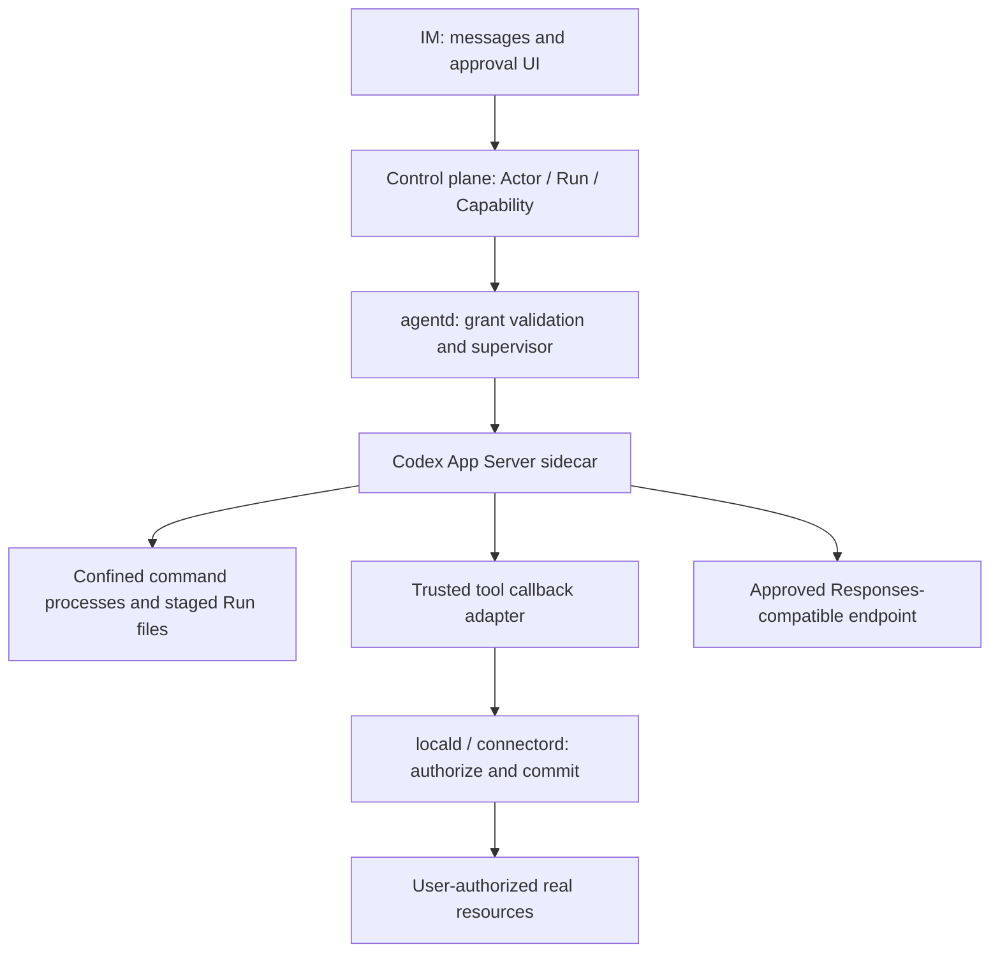

# OpenAI Agent Runtime for Threadline: source audit, experiments, and integration decision

Date: 2026-09-16. Issue: [#207](https://github.com/monkeylabx/threadline/issues/207). Status: architecture proposal with bounded macOS experiments; not production acceptance. This report supersedes earlier candidate rankings. It does not change Frozen Scope.

## Decision and the requirement that can change it

**Use a separately supervised Codex App Server as the preferred integration seam, conditional on the enterprise model endpoint supporting its Responses protocol. Do not embed codex-core in the IM process.** Codex supplies an existing execution service and native command-confinement machinery; Threadline owns authorization, Connector effects, process supervision, data retention, and distribution.

This is not an unconditional recommendation to use Codex with any model. In the audited release, the provider transport supports **Responses only**, not native Anthropic Messages or Chat Completions. If direct Claude Messages or another incompatible enterprise protocol is required without a translation service, **Codex does not meet that requirement as configured**. OpenAI Agents SDK is then the credible OpenAI alternative: it has broader provider seams and a substantial SandboxAgent runtime, but Threadline must package a Python service and harden its execution backend.

The available evidence supports choosing an integration boundary, not approving a production release. The practical decision is:

| Requirement | Route | Reason |
| --- | --- | --- |
| Required endpoint implements the tested Responses contract | Codex App Server sidecar | Reuse service/protocol, execution loop, approval events and command sandbox |
| Native heterogeneous model protocols are mandatory; no translation gateway | Agents SDK service + separately validated backend | Public provider interfaces give more transport control; extra service/backend ownership |
| App Server lacks a specific indispensable feature that cannot be adapted outside it | Consider a narrow upstream contribution or fork | Direct core embedding is a last resort with an explicit maintenance budget |
| All three desktop platforms must ship immediately with demonstrated equivalent isolation | No candidate approved by this report | Only a bounded macOS Codex probe ran; SDK, Windows and Linux remain untested |

No arbitrary numerical scores or production delivery estimates are assigned. Protocol fit and permission enforcement are hard gates; language preference cannot compensate for failing them.

## Product constraints and baseline

Threadline is an enterprise IM with permissioned Agent actors. IM must work while models/runtime are offline. A Channel is not a runtime session. Local resources require a user-authorized Connector; high-impact effects require visible approval. The [delivery plan](../delivery-plan.md) places v1 execution on Desktop/Workstation and excludes Enterprise Runner. [Trust boundaries](../security/trust-boundaries.md) and [ADR-0001](../adr/0001-client-platform.md) already separate IM, locald, agentd and connectord.

The [PRD](../product-requirements.md) describes an existing self-owned agent-core with Run/Step, events, artifacts, file approval and subprocess support, but missing loop, cancellation, service API, capability enforcement and concurrent-write protection. That source was not available for inspection. Current [agentd](../../services/agentd/main.go) is an empty entry point and [Go dependencies](../../services/go.mod) do not import that core. Its documented state/event contracts may be retained; its execution implementation is not assumed safe or complete.

## Evidence and version identity

| Artifact | Exact identity | Evidence level |
| --- | --- | --- |
| Codex public source | `rust-v0.154.0`, commit `6b9826e3aa83b1a5947db50f4332cb9c65f1b340` | Downloaded release-tag source; selected execution paths inspected |
| Codex macOS arm64 binary | Official `codex-aarch64-apple-darwin.tar.gz`, version `0.154.0`; archive SHA256 `344310a0a591c1b192e04feff304321a69907c9498baaac331ca7e16ebcef9d7` | Downloaded from official release; local checksum matched release API digest; executed in temporary test setup |
| Agents Python SDK | Commit `fbf59a40e9da5adb88d370fefaeaae0478376d4a`; pyproject version `0.22.2` | Fixed source inspected, not a verified release binary; no SDK execution |
| Earlier installed Codex | `0.154.0-alpha.6.2` | Historical probe only; conclusions below use the public fixed release where stated |

[Codex release](https://github.com/openai/codex/releases/tag/rust-v0.154.0), [Codex source snapshot](https://github.com/openai/codex/tree/6b9826e3aa83b1a5947db50f4332cb9c65f1b340), [SDK source snapshot](https://github.com/openai/openai-agents-python/tree/fbf59a40e9da5adb88d370fefaeaae0478376d4a). Checksum matching authenticates against the published digest; it is not a reproducible-build or supply-chain audit. Codex is Apache-2.0; Agents Python SDK is MIT ([Codex license](https://github.com/openai/codex/blob/rust-v0.154.0/LICENSE), [SDK license](https://github.com/openai/openai-agents-python/blob/fbf59a40e9da5adb88d370fefaeaae0478376d4a/LICENSE)). Open-source runtime licensing does not license model weights or eliminate model service costs.

## What the Codex source actually implements

### Model transport is a selection gate

`WireApi` contains only `Responses`; deserialization explicitly rejects `chat`. Provider configuration exposes URL, authentication and headers, but does not implement Anthropic Messages. The actual streaming dispatch matches `WireApi::Responses` ([provider type and parser](https://github.com/openai/codex/blob/rust-v0.154.0/codex-rs/model-provider-info/src/lib.rs#L65), [dispatch](https://github.com/openai/codex/blob/rust-v0.154.0/codex-rs/core/src/client.rs#L2038)).

A gateway is an additional maintained component, not a free config change. Acceptance must cover streamed tool calls, cancellation, errors, context compaction and usage accounting, not just a text response. No model request was made in this research, so endpoint compatibility and task quality remain unknown.

### The tool protocol is useful, but authority remains outside it

Dynamic tools emit a client request and await a result; they do not execute the client's callback inside the command sandbox. `thread/start.dynamicTools` is experimental ([dynamic handler](https://github.com/openai/codex/blob/rust-v0.154.0/codex-rs/core/src/tools/handlers/dynamic.rs#L174), [App Server dispatch](https://github.com/openai/codex/blob/rust-v0.154.0/codex-rs/app-server/src/bespoke_event_handling.rs#L1102), [protocol field](https://github.com/openai/codex/blob/rust-v0.154.0/codex-rs/app-server-protocol/src/protocol/v2/thread.rs#L138)). This is a good Connector seam if version-pinned; model-supplied arguments and tool availability are not grants.

Local stdio MCP servers use a direct process launcher, distinct from the generated-command sandbox. Environment reconstruction and process grouping are present, but not equivalent filesystem/network confinement ([launcher selection](https://github.com/openai/codex/blob/rust-v0.154.0/codex-rs/codex-mcp/src/rmcp_client.rs#L1151), [direct spawn](https://github.com/openai/codex/blob/rust-v0.154.0/codex-rs/rmcp-client/src/stdio_server_launcher.rs#L256)). Threadline must not automatically import arbitrary user/project MCP configurations. Only trusted Connector adapters run outside the sandbox; untrusted third-party tools require separate containment.

### Interrupt is deliberately different from revoking execution

The process manager explicitly retains live terminal processes so turn interruption does not terminate them. `interrupt` and background-terminal cleanup are separate handlers ([process retention](https://github.com/openai/codex/blob/rust-v0.154.0/codex-rs/core/src/unified_exec/process_manager.rs#L568), [handlers](https://github.com/openai/codex/blob/rust-v0.154.0/codex-rs/core/src/session/handlers.rs#L59)). Full shutdown aborts work, terminates managed processes and shuts down MCP; terminal cleanup APIs are experimental ([shutdown](https://github.com/openai/codex/blob/rust-v0.154.0/codex-rs/core/src/session/handlers.rs#L407), [protocol](https://github.com/openai/codex/blob/rust-v0.154.0/codex-rs/app-server-protocol/src/protocol/common.rs#L710)).

Threadline's security Stop must therefore: revoke Connector grants and queued effects; interrupt inference; terminate managed execution; verify termination; record already-committed remote effects. An interrupt acknowledgement is insufficient. The experiment below verifies `command/exec/terminate` for one direct command, not arbitrary turn cancellation or detached descendants.

### Privacy and recovery require an explicit choice

Ephemeral mode defaults false. Enabling it skips live-thread persistence/state DB paths and disables some history/queue operations ([default](https://github.com/openai/codex/blob/rust-v0.154.0/codex-rs/core/src/config/mod.rs#L4261), [session persistence](https://github.com/openai/codex/blob/rust-v0.154.0/codex-rs/core/src/session/session.rs#L856), [queue restriction](https://github.com/openai/codex/blob/rust-v0.154.0/codex-rs/app-server/src/request_processors/thread_queue_processor.rs#L247)). It does not establish that logs, artifacts or external tools retain nothing.

For the initial integration, use isolated configuration/state roots per trust scope. Choose either an ephemeral Run with Threadline-managed minimal recovery, or retained runtime history with explicit encryption/retention/deletion controls. Do not promise both zero durable runtime history and transparent Codex history recovery.

## Isolation investigation: cause, controls, and bounded results

All fixtures are synthetic. No model credentials or real user documents were used. Public binaries were placed under `/tmp`; the installed Codex application and personal configuration were not changed. Public-release experiments used a child-only isolated `CODEX_HOME` and minimal environment. Outer sandbox restrictions prevented nested Seatbelt startup, so the approved tests ran Codex's own sandbox outside that outer restriction.

### Why the earlier deny experiment failed

The failure reproduced on the official release with a clean configuration, so it was not explained merely by the installed alpha or personal configuration. A direct Seatbelt control denied the same file access, proving that the OS mechanism worked.

Source inspection found `MACOS_PROCESS_PLATFORM_DEFAULTS`: when platform defaults are included, it independently allows access to `/Applications` and scratch directories including `/private/tmp`. Ordinary unreadable paths are exclusions in generated allow rules; the independent platform allowances can still permit them. Glob-deny rules, however, generate explicit deny statements appended after platform defaults ([platform allowances](https://github.com/openai/codex/blob/rust-v0.154.0/codex-rs/sandboxing/src/seatbelt.rs#L24), [glob deny generation](https://github.com/openai/codex/blob/rust-v0.154.0/codex-rs/sandboxing/src/seatbelt.rs#L636), [policy assembly](https://github.com/openai/codex/blob/rust-v0.154.0/codex-rs/sandboxing/src/seatbelt.rs#L1021)).

Keeping `:minimal` and changing the synthetic denied directory to a `/**` glob made the same read/write probe fail as intended. Removing platform defaults instead caused the test shell to exit 134 before reporting operations; that attempt was not a successful isolation test. This investigation explains the tested scratch-directory behavior; it is not a claim that all ordinary denies fail, nor proof that one glob produces a complete workspace-only policy.

### Executed results

| Test | Observed result | Interpretation |
| --- | --- | --- |
| Release archive digest/version | Digest matched; binary reported 0.154.0 | Versioned artifact, not just moving documentation |
| Clean-config ordinary path deny under `/private/tmp` with `:minimal` | Outside read/write allowed | Failed intended restriction; platform allowance interaction identified |
| Direct Seatbelt deny control | Outside read/write denied | OS enforcement available on this host |
| Codex glob deny, allowed workspace write | Exit 0 | Positive control passes |
| Codex glob deny, direct outside read | Exit 1 / Operation not permitted | Negative control passes |
| Symlink inside workspace pointing to denied fixture | Exit 1 / Operation not permitted | This symlink case denied |
| Child shell reading denied fixture | Exit 1 / Operation not permitted | This child inherited confinement |
| Write into denied fixture directory | Exit 1 / Operation not permitted | This write denied |
| Local HTTP server without sandbox | curl exit 0 | Target reachable before network test |
| Same local target in Codex sandbox with network disabled | curl exit 7 | Connection blocked in this test; not a full DNS/egress test |
| App Server stdio initialize | Result returned | Actual protocol handshake passes |
| `command/exec` with streaming | Output notification observed | Direct command execution path works |
| `command/exec/terminate` | Empty success result; original command exited 137 | Explicit termination of this command works |

**Not tested:** an actual model turn, model-driven approvals/dynamic tools, detached process escape, forced supervisor crash, remote MCP effects, history recovery, all filesystem aliases/hard links, domain-filtered public egress, Windows, Linux, signed desktop packaging, arbitrary user directories, or SDK execution. No production safety certification follows from these tests.

## Agents SDK: source-level comparison, not an API-wrapper dismissal

At the inspected SDK commit, SandboxAgent adds capabilities, workspace manifests and execution identity to Agent. The runtime session manager creates/acquires sessions, coordinates startup and cleanup, tracks ownership and prevents concurrent reuse of one agent object. Caller-owned sessions are not cleaned automatically ([agent](https://github.com/openai/openai-agents-python/blob/fbf59a40e9da5adb88d370fefaeaae0478376d4a/src/agents/sandbox/sandbox_agent.py#L30), [manager](https://github.com/openai/openai-agents-python/blob/fbf59a40e9da5adb88d370fefaeaae0478376d4a/src/agents/sandbox/runtime_session_manager.py#L47)).

| Source finding | Integration consequence |
| --- | --- |
| UnixLocal wraps execution in sandbox-exec on macOS; non-macOS returns the original command | Earlier blanket wording “UnixLocal has no sandbox” was inaccurate for this source. Platform behavior differs. [Source](https://github.com/openai/openai-agents-python/blob/fbf59a40e9da5adb88d370fefaeaae0478376d4a/src/agents/sandbox/sandboxes/unix_local.py#L641) |
| Darwin policy starts `allow default`, adds filesystem restrictions/exceptions, and no network deny | Filesystem confinement is not default-deny network isolation. [Profile](https://github.com/openai/openai-agents-python/blob/fbf59a40e9da5adb88d370fefaeaae0478376d4a/src/agents/sandbox/sandboxes/unix_local.py#L823) |
| `inherit_host_environment=True` by default | Explicitly remove credential inheritance. [Configuration](https://github.com/openai/openai-agents-python/blob/fbf59a40e9da5adb88d370fefaeaae0478376d4a/src/agents/sandbox/sandboxes/unix_local.py#L1185) |
| Docker `network_mode=None`; container creation lacks an explicit restrictive user, cap_drop, read-only root and resource limits | Image/backend hardening remains an integration task. [Options](https://github.com/openai/openai-agents-python/blob/fbf59a40e9da5adb88d370fefaeaae0478376d4a/src/agents/sandbox/sandboxes/docker.py#L213), [creation](https://github.com/openai/openai-agents-python/blob/fbf59a40e9da5adb88d370fefaeaae0478376d4a/src/agents/sandbox/sandboxes/docker.py#L1721) |
| Some mounts add SYS_ADMIN and apparmor:unconfined, optionally FUSE | Disallow those mount modes in the initial policy; Docker sessions are not uniformly constrained. [Mount handling](https://github.com/openai/openai-agents-python/blob/fbf59a40e9da5adb88d370fefaeaae0478376d4a/src/agents/sandbox/sandboxes/docker.py#L1753) |
| Shell tool defaults `needs_approval=False`; tools can be configured | Existing approval mechanism still needs enterprise policy. [Tool](https://github.com/openai/openai-agents-python/blob/fbf59a40e9da5adb88d370fefaeaae0478376d4a/src/agents/sandbox/capabilities/tools/shell_tool.py#L176) |
| Public ModelProvider and MultiProvider seams support multiple provider adapters | More adaptable than Codex's fixed Responses wire protocol; every target model still needs a test. [Routing](https://github.com/openai/openai-agents-python/blob/fbf59a40e9da5adb88d370fefaeaae0478376d4a/src/agents/models/multi_provider.py#L62) |
| Ordinary Python function tools invoke host callbacks; tracing is enabled by default | Host tools require trusted Connector checks; explicitly choose exporter/data policy. [Invocation](https://github.com/openai/openai-agents-python/blob/fbf59a40e9da5adb88d370fefaeaae0478376d4a/src/agents/tool.py#L2218), [tracing](https://github.com/openai/openai-agents-python/blob/fbf59a40e9da5adb88d370fefaeaae0478376d4a/src/agents/run_config.py#L397) |

This snapshot is more specific than earlier documentation-only conclusions. SandboxAgent lifecycle is reusable; it is not necessary to rebuild it. The SDK's additional Threadline ownership is the service boundary, Python packaging, selected backend hardening, platform support and orphan reconciliation. No SDK backend was run in this investigation.

SDK timeout cleanup also differs by backend: UnixLocal kills its process group, while Docker user execution uses best-effort command-line matching for cleanup. Neither source path proves arbitrary detached descendants are gone; cancellation and crash reconciliation need their own tests ([UnixLocal timeout](https://github.com/openai/openai-agents-python/blob/fbf59a40e9da5adb88d370fefaeaae0478376d4a/src/agents/sandbox/sandboxes/unix_local.py#L278), [Docker timeout](https://github.com/openai/openai-agents-python/blob/fbf59a40e9da5adb88d370fefaeaae0478376d4a/src/agents/sandbox/sandboxes/docker.py#L555)).

## Concrete Threadline architecture



A Run maps to an explicit runtime thread/turn; a Channel never implicitly becomes its history. For the first slice, isolate process/config/state by trust scope and use staged input/output. Connector grants remain narrower than filesystem access necessary to launch the runtime. Do not attach IM databases, browser profiles or an entire user HOME.

| Contract | Threadline implementation | Why the runtime alone is insufficient |
| --- | --- | --- |
| StartRun | Validate Actor, selected context, local grant intersection, endpoint policy; start isolated runtime and initialize schema-compatible client | Server permission cannot enlarge local user authorization |
| Tool request | Validate Run, resource, operation, canonical arguments, expiry and current revocation at Connector | A callback arriving from localhost or Codex is not authority |
| Approval | Bind approval to canonical operation/content version and intended audience | Changed parameters or restored history cannot reuse an unrelated approval |
| Commit effect | Recheck grant, deduplicate operation ID, return durable receipt | Checkpoint replay does not guarantee exactly-once external effects |
| StopRun | Revoke queued/uncommitted capabilities, interrupt, clean execution, verify, escalate to supervised shutdown if necessary | Background terminals intentionally survive ordinary interrupt |
| ResumeRun | Reauthorize; restore only permitted state; reconcile receipts | Restored history is not a restored grant |
| Publish | User-approved output and audience through the product contract | Reading a local file does not authorize external disclosure |

The runtime process may retain more privileges than its command children. Restrict enabled features/config sources; keep only trusted adapters outside confinement. If the threat model includes compromised runtime/plugin code, add an outer process boundary with narrowly granted broker access. Do not claim the built-in command sandbox contains the entire application.

## Engineering ownership and measured gates

| Area | App Server route | Direct core embedding | SDK route |
| --- | --- | --- | --- |
| Loop/context/tool engine | Reuse | Reuse, coupled to internal Rust APIs | Reuse Agent/SandboxAgent |
| Process protocol | Existing JSON-RPC; versioned adapter | Build product-facing service/FFI and track internal APIs | Build Python service/IPC |
| Authorization/Connector | Implement once in Threadline | Same | Same |
| Isolation | Configure/audit native command sandbox; contain other tools | Same machinery plus own wiring | Select/harden backend; reconcile platform differences |
| Cancellation/recovery | Adapt separate interrupt/cleanup and retention semantics | Own integration with internal lifecycle | Adapt session ownership/cleanup and persistence |
| Packaging/upgrades | Ship pinned sidecar; schema compatibility tests | Maintain Rust workspace/fork and integration tests | Ship Python environment plus selected backend |

[Core dependency surface](https://github.com/openai/codex/blob/rust-v0.154.0/codex-rs/core/Cargo.toml). Cost comparisons are structural, not measured person-month estimates. Each evaluation task should fit the repo's half-day to two-day issue rule; production work is split after evidence exists.

1. **Model contract gate (1–2 engineer-days):** test the actual enterprise endpoint with streaming tools, errors and cancellation. If native Anthropic is mandatory, explicitly price/accept a gateway or choose SDK before implementation. This cannot be resolved without a selected endpoint; no credentials were used here.
2. **Same vertical slice (up to 2 engineer-days per route):** fixed runtime, fake tool/model fixture where applicable, approved Connector operation, confined command, StopRun and receipt-aware resume. Count adapter code, external dependencies and unimplemented controls; do not grade task quality using a fake model.
3. **Isolation/stop gate (1–2 days per target OS, split as needed):** deny real-category synthetic fixtures outside default scratch allowances; aliases, child/detached processes, delayed effects, supervisor crash and failed sandbox startup. Any uncontained effect blocks release.
4. **Data/distribution gate:** independent configuration, state retention/deletion, credential broker, signed updates, downgrade handling, offline install and model-unavailable IM behavior. Estimate after target packaging is known.
5. **ADR:** record the selected model contract, runtime/version, allowed features, trust boundary and accepted maintenance owner; then propose Frozen Scope changes. Existing agent-core is not silently replaced by this document.

The immediate research conclusion is a **conditional App Server architecture with identified integration obligations**, not “all security solved by choosing Codex.” The remaining work is explicitly model/platform acceptance rather than another unbounded search for frameworks.

## Other candidates retained for context

Claude Agent SDK wraps a commercially licensed engine; its Python wrapper license does not make the engine open source. Goose and OpenCode are full open-source alternatives but do not remove Connector or host-isolation obligations. Eino is an orchestration component, not a substitute for the service boundary examined here. OpenHands' container-oriented deployment is relevant to a future remote-worker scope, not v1's default. These candidates are not ranked again in this OpenAI-focused decision ([Claude](https://github.com/anthropics/claude-agent-sdk-python), [Goose](https://github.com/aaif-goose/goose), [OpenCode](https://github.com/anomalyco/opencode), [Eino](https://github.com/cloudwego/eino), [OpenHands](https://github.com/OpenHands/software-agent-sdk)).

## Reproduction appendix

The scripts below are the test harnesses used in this investigation, embedded so the single research artifact is sufficient to recreate them. They require the exact macOS arm64 binary listed above and Python 3. They do not install dependencies, call a model, or use real secrets. Run only on temporary fixture directories; the filename writes are deliberate. `CODEX_HOME` is configured only for child test processes, not changed in the parent shell or installed app.

Setup: download the official archive, verify its SHA256 against the value above, extract `codex-aarch64-apple-darwin` into `/private/tmp/threadline-runtime-deep`, and create `isolated-config` there. Create `/private/tmp/threadline-runtime-probe/{workspace,outside}` and place the text `synthetic-test-data` in `outside/fake-secret.txt`. The HTTP fixture binds only loopback and returns static synthetic data. The protocol harness discards runtime stderr; it is an execution check, not a logging/privacy audit.

### security_probe.py

```python
import subprocess,json,http.server,threading
from pathlib import Path
b=Path('/private/tmp/threadline-runtime-deep'); w=Path('/private/tmp/threadline-runtime-probe/workspace'); outside=w.parent/'outside'
link=w/'secret-link';link.unlink(missing_ok=True);link.symlink_to(outside/'fake-secret.txt')
class Handler(http.server.BaseHTTPRequestHandler):
 def do_GET(self):self.send_response(200);self.end_headers();self.wfile.write(b'fixture')
 def log_message(self,*args):pass
server=http.server.HTTPServer(('127.0.0.1',0),Handler)
threading.Thread(target=server.serve_forever,daemon=True).start()
url='http://127.0.0.1:'+str(server.server_port)
env={'PATH':'/usr/bin:/bin','CODEX_HOME':str(b/'isolated-config')}
profile='permissions.threadline-glob.filesystem={":minimal"="read","/private/tmp/threadline-runtime-probe/workspace"="write","/private/tmp/threadline-runtime-probe/outside/**"="deny"}'
base=[str(b/'codex-aarch64-apple-darwin'),'sandbox','-P','threadline-glob','-c',profile,'-c','permissions.threadline-glob.network.enabled=false','-C',str(w)]
cases=[('write_allowed',['/bin/sh','-c','printf ok > output.txt'],True),('direct_read_denied',['/bin/cat',str(outside/'fake-secret.txt')],False),('symlink_read_denied',['/bin/cat',str(link)],False),('child_read_denied',['/bin/sh','-c','/bin/cat '+str(outside/'fake-secret.txt')],False),('write_denied',['/bin/sh','-c','printf fail > '+str(outside/'blocked.txt')],False),('loopback_denied',['/usr/bin/curl','--noproxy','*','-fsS','--max-time','2',url],False)]
control=subprocess.run(cases[-1][1],capture_output=True,text=True,timeout=5)
results={'loopback_control':control.returncode,'cases':[]}
for name,cmd,success in cases:
 r=subprocess.run(base+cmd,env=env,capture_output=True,text=True,timeout=10)
 results['cases'].append({'name':name,'exit':r.returncode,'passed':(r.returncode==0)==success,'stderr':r.stderr[:500]})
server.shutdown();print(json.dumps(results,indent=2));(b/'security-result.json').write_text(json.dumps(results,indent=2))
```

### protocol_probe.py

```python
import subprocess,queue,threading,json,time,os
from pathlib import Path
b=Path('/private/tmp/threadline-runtime-deep')
env={'PATH':'/usr/bin:/bin','CODEX_HOME':str(b/'isolated-config')}
q=queue.Queue(); seen=[]
p=subprocess.Popen([str(b/'codex-aarch64-apple-darwin'),'app-server','--stdio','-c','analytics.enabled=false'],cwd=str(b),env=env,stdin=subprocess.PIPE,stdout=subprocess.PIPE,stderr=subprocess.DEVNULL,text=True)
def read():
 for line in p.stdout:
  try:q.put(json.loads(line))
  except ValueError: pass
threading.Thread(target=read,daemon=True).start()
def send(method,params,identifier=None):
 v={'method':method,'params':params}
 if identifier is not None:v['id']=identifier
 p.stdin.write(json.dumps(v)+'\n');p.stdin.flush()
def until(pred,seconds=15):
 end=time.monotonic()+seconds
 while time.monotonic()<end:
  v=q.get(timeout=max(.1,end-time.monotonic()));seen.append(v)
  if pred(v):return v
 raise TimeoutError()
try:
 send('initialize',{'clientInfo':{'name':'threadline_research','version':'0.1'},'capabilities':{'experimentalApi':True}},1)
 r=until(lambda x:x.get('id')==1);print('initialize', 'result' in r)
 send('initialized',{})
 send('command/exec',{'command':['/bin/sh','-c','echo READY; sleep 30'],'processId':'probe-process','streamStdoutStderr':True,'sandboxPolicy':{'type':'readOnly'},'timeoutMs':10000},2)
 r=until(lambda x:x.get('method')=='command/exec/outputDelta' or x.get('id')==2)
 print('exec_first_event',r.get('method','response'),r.get('error'))
 if 'error' not in r and r.get('id')!=2:
  send('command/exec/terminate',{'processId':'probe-process'},3)
  term=until(lambda x:x.get('id')==3);print('terminate',term)
  done=next((x for x in seen if x.get('id')==2),None) or until(lambda x:x.get('id')==2)
  print('exec_complete',done)
finally:
 p.terminate()
 try:p.wait(timeout=5)
 except subprocess.TimeoutExpired:p.kill();p.wait()
 (b/'protocol-result.json').write_text(json.dumps(seen,indent=2))
```

### Recreate the failing ordinary deny and OS control

After saving `security_probe.py` above in the temporary test directory, the following derives the failing ordinary-path variant without changing the working script. All six operations remain confined to synthetic fixtures; read/write denial assertions are expected to fail for the ordinary-path variant. The direct OS control is expected to deny the same read/write operations.

```python
from pathlib import Path
import subprocess
b = Path('/private/tmp/threadline-runtime-deep')
original = (b / 'security_probe.py').read_text()
ordinary = original.replace(
    '/private/tmp/threadline-runtime-probe/outside/**',
    '/private/tmp/threadline-runtime-probe/outside',
).replace('security-result.json', 'ordinary-security-result.json')
(b / 'ordinary_security_probe.py').write_text(ordinary)
subprocess.run(['python3', str(b / 'ordinary_security_probe.py')], check=True)
policy = ('(version 1)(allow default)'
          '(deny file-read-data (subpath "/private/tmp/threadline-runtime-probe/outside"))'
          '(deny file-write* (subpath "/private/tmp/threadline-runtime-probe/outside"))')
for command in [
    ['/bin/cat', '/private/tmp/threadline-runtime-probe/outside/fake-secret.txt'],
    ['/bin/sh', '-c', 'printf test > /private/tmp/threadline-runtime-probe/outside/os-control.txt'],
]:
    result = subprocess.run(['/usr/bin/sandbox-exec', '-p', policy, *command],
                            capture_output=True, text=True)
    print('OS control exit:', result.returncode, result.stderr.strip())
```

Independent source reviewers checked the Codex and SDK sections against the fixed snapshots. Their review did not extend runtime coverage beyond the experiments explicitly listed above.
