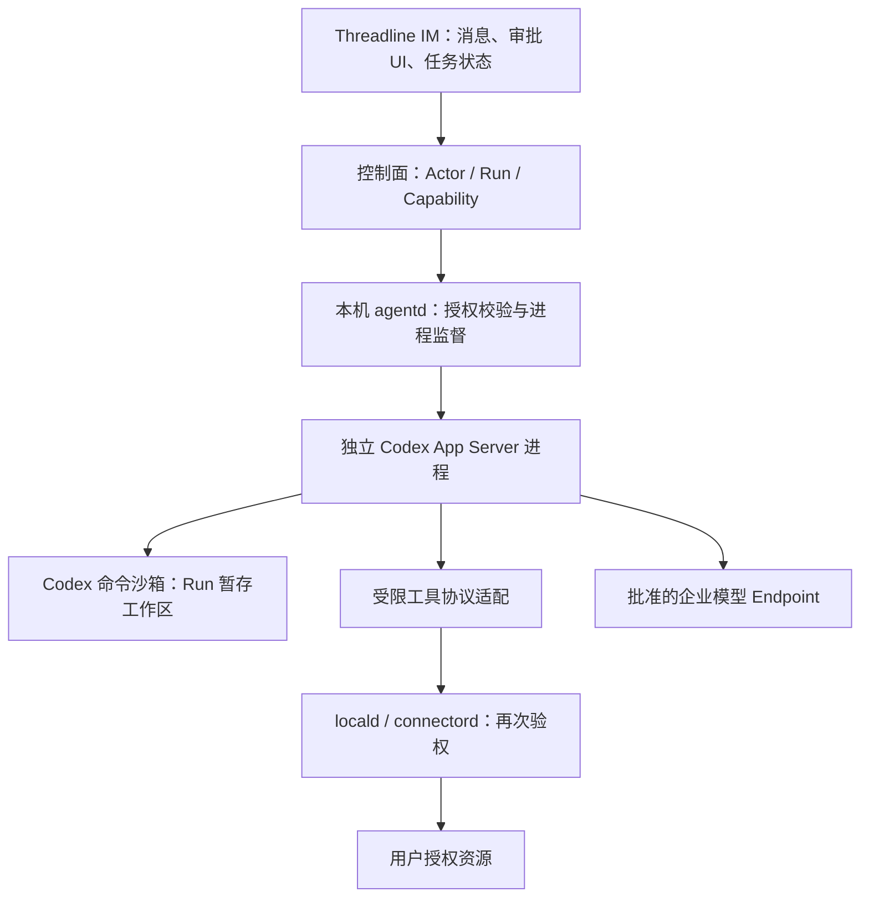

# Threadline：OpenAI 开源 Agent Runtime 接入方案

日期：2026-09-16。任务 [#207](https://github.com/monkeylabx/threadline/issues/207)，提案 [#208](https://github.com/monkeylabx/threadline/pull/208)。本文替换前几轮分散的候选排序。研究结论与实测结果分别陈述；不修改 Frozen Scope，也不表示生产安全验收通过。

## 决策

**建议采用独立 Codex App Server 进程作为 Threadline 本地 Agent 执行底座，通过协议适配；第一阶段不直接链接 codex-core，不自写 Agent 循环。** 这是针对现成服务接口、开源实现和可复用原生沙箱的架构建议。上线前必须通过本文的文件权限、模型兼容、取消和分发门槛；本机实验目前没有达到读隔离预期，所以不能把此建议标成已验证可发布。

OpenAI Agents SDK 是另一条真实的运行库路线：当前已提供 SandboxAgent、工作区和沙箱生命周期，不能再称为“只调用 LLM”。若 Codex 的企业模型或工具限制无法满足要求，再比较它与受控隔离后端；不同时开发两套生产运行端。

本轮目标是选择 **OpenAI 开源执行底座**，不是比较模型质量。开源执行引擎不代表模型权重开源，也不代表模型调用免费或任意企业 Endpoint 均兼容。

## 当前工程基线

[PRD](../product-requirements.md)记载自有 agent-core 有 Run/Step、事件、文件审批、产物和子进程能力，但缺多轮 loop、取消、服务 API、Capability 强制执行和并发写锁。本次没有取得该库源码验证。[agentd](../../services/agentd/main.go)仍是空入口，[Go 依赖](../../services/go.mod)没有接入该库。保留已有产品契约，不凭文档假设其执行实现可继续复用。

[交付计划](../delivery-plan.md)要求桌面运行 Agent、移动端发起/观察/中断/审批、企业模型路由与离线安装；v1 不含 Enterprise Runner。[信任边界](../security/trust-boundaries.md)和[客户端 ADR](../adr/0001-client-platform.md)已有 IM、agentd、locald、connectord 分离要求。本文落实这些边界，不把云端执行服务引入 v1 默认架构。

## OpenAI 三条接入路线，同一标准比较

| 维度 | Codex App Server：推荐路线 | 直接链接/修改 codex-core | OpenAI Agents Python SDK + SandboxAgent |
| --- | --- | --- | --- |
| 开源范围 | Codex 仓库 Apache-2.0，实际执行引擎 | 同一仓库，直接依赖内部 Rust crate | Python 仓库 MIT；沙箱模块标 Beta |
| 已有执行能力 | Agent 循环、上下文、线程/轮次、工具执行、审批事件 | 可复用相同底层代码；宿主接口自己组织 | 循环、工具、handoff、会话、审批恢复；沙箱工作区/快照/生命周期 |
| 接入形态 | 独立子进程，JSON-RPC stdio；Threadline 保留自己的 UI | Rust 内嵌或 fork；Go 控制层需再建边界 | Python 运行库；需构建 Threadline 进程服务/API |
| 隔离复用 | Codex 原生命令沙箱；外部工具单独约束 | 沙箱代码可复用，但接线和配置由自己维护 | Unix-local 不是 OS 强隔离；Docker/其他后端提供隔离 |
| 平台代价 | 原生平台实现可核验；必须按发行版实测 | 随整个 Rust workspace 构建，跨平台升级负担更大 | Unix-local 面向 macOS/Linux；Windows 官方建议 Docker/托管后端 |
| 模型入口 | 自定义 Provider；需要实际协议/工具调用兼容验证 | 能修改实现，但承担合并和兼容成本 | 多模型适配接口；所需模型仍需实际工具测试 |
| 维护范围 | 协议适配、授权、Connector、进程监督和发布 | 前述全部，加内部 API 与上游源码变动 | 前述产品边界，加服务封装与隔离后端分发 |
| 决策 | 最符合“复用现成运行端”的第一选择 | 仅当有确定的协议缺口且无法在外层解决 | Codex 不满足明确需求时的备选，不等同零开发 |

来源：[Codex LICENSE](https://github.com/openai/codex/blob/main/LICENSE)、[App Server](https://learn.chatgpt.com/docs/app-server)、[core Cargo.toml](https://github.com/openai/codex/blob/main/codex-rs/core/Cargo.toml)、[Agents SDK](https://openai.github.io/openai-agents-python/)、[SDK LICENSE](https://github.com/openai/openai-agents-python/blob/main/LICENSE)、[Sandbox clients](https://openai.github.io/openai-agents-python/sandbox/clients/)、[Sandbox concepts](https://openai.github.io/openai-agents-python/sandbox/guide/)。维护成本与推荐为工程推论；未声称上游为内部 crate 提供稳定嵌入 API。

### Agents SDK 的能力与边界

SandboxAgent 已支持 manifest 定义工作区、Shell/Filesystem 能力、快照及可恢复会话。Runner 能管理所拥有沙箱的创建/恢复/停止/删除；调用方传入的现成 session 则需要调用方清理。不能说这些能力全部要自研。[概念](https://openai.github.io/openai-agents-python/sandbox/guide/)

但 UnixLocalSandboxClient 执行的是宿主进程，拥有宿主文件/网络访问，默认继承宿主环境；需明确配置环境继承。Docker 后端提供容器边界，禁网需显式设置 `network_mode="none"`。普通 Python 工具和 MCP 可以在沙箱外运行；manifest 文件 Permissions 不是 Threadline 的业务授权。Windows 本机采用何种隔离后端，是分发方案的一部分。[后端与默认值](https://openai.github.io/openai-agents-python/sandbox/clients/)、[工具边界](https://openai.github.io/openai-agents-python/sandbox/guide/)

## 推荐架构



- **Codex 负责执行机制：**模型工具循环、上下文管理、执行事件及其原生命令沙箱。第一版使用进程协议，不把 Codex 放进 IM UI 主进程。
- **Threadline 负责权限语义：**谁能访问哪些频道/消息/文件、授权期限、外发受众、审批与审计。Codex 的批准不能扩大本地用户 grant。
- **agentd 负责监督：**创建/停止运行端、资源预算、取消顺序、状态投影和崩溃处理。它不执行生成的代码，不加载任意第三方插件。
- **Connector 负责真实资源：**Run 只读写必要的输入副本与临时产物。真实用户目录通过 Connector 读取/提交，不为方便挂入 HOME、IM 数据库或整盘。高影响动作在 Connector 提交时再次验权。

一个 Channel 可以涉及多个 Run；一个 Run 映射至明确的 Codex thread/turn，绝不把 Channel 历史默认全部灌入 Codex。恢复时重新取得有效 grant，历史审批不是永久权限。初期为不同信任范围使用独立进程、配置根与工作区，验证后再考虑复用进程。

### 协议适配的最小合同

| Threadline 行为 | Codex 接口/事件 | Threadline 仍需做 |
| --- | --- | --- |
| 建立运行端 | `initialize` / `initialized` | 锁定版本与 schema，拒绝不兼容协议 |
| 创建运行上下文 | `thread/start` | 显式 cwd、模型路由、审批及权限策略；内部维护 Run→thread 映射 |
| 发起任务 | `turn/start` | 仅提供授权 ContextScope；校验附件来源与模型出口范围 |
| 展示过程 | item / turn 事件 | 转成脱敏任务状态；不自动发布完整私有记录 |
| 处理审批 | command/file approval 请求 | 绑定 Run、资源、参数、内容版本、到期时间，拒绝过期/变更请求 |
| 接企业工具 | MCP 或适合的动态工具接口 | Connector 每次鉴权；不假设工具继承 Codex shell 沙箱 |
| 取消 | `turn/interrupt`，必要时监督器回收进程 | 先撤权，再中断，最后确认进程和未提交动作停止 |
| 恢复 | thread resume 类接口 | 恢复工作状态，不恢复过期能力；副作用 operation ID 去重 |

[官方协议](https://learn.chatgpt.com/docs/app-server)。动态工具等能力存在实验字段，需对实际发行版导出 schema；不能直接把最新网页样例当作已安装版本的合同。`command/exec` 是另一条宿主执行入口，不应直接暴露给 IM 或模型绕过 Connector。

### 安全配置必须落实的事项

1. **读隔离单独验收。**工作区可写并不意味着其他目录不可读；默认临时目录许可也可能跨 Run。先得到实际生效策略，再用工作区外假文件验证拒绝，不能只看配置文字。
2. **沙箱覆盖范围分开处理。**命令沙箱、外部 MCP、客户端动态工具、插件和模型出口各有边界。禁止任意扩展加载；模型生成的代码和所有后代进程必须在受限执行环境内。
3. **网络限制不能只写域名表。**官方当前权限文档明确网络放行与代理过滤是独立开关；网络开启、代理未启用时域名表不构成过滤。模型 API 权限与工具网络权限分开，禁止任意出口。[权限配置](https://learn.chatgpt.com/docs/permissions)
4. **身份与凭据不下放。**企业模型密钥不交给任意 shell，Connector 使用短期、限定 Run 和对象的能力。使用独立配置/缓存/历史；不继承个人插件、订阅认证或项目中的放宽策略。
5. **取消不是回滚。**先使尚未提交的 Connector 操作失去执行权，再发 interrupt，超时后回收受管理进程树。已完成的远端操作保留回执，需要补偿时另走授权；不能用“UI 已停止”证明无副作用。
6. **失败关闭执行能力。**沙箱初始化失败、策略无法验证、授权失效或协议不兼容时停止该 Run；IM 继续工作。禁止自动退回普通宿主进程。

## 本机验证记录：明确通过和未通过

环境：macOS，本机应用随附 `/Applications/ChatGPT.app/Contents/Resources/codex`，版本 **0.154.0-alpha.6.2**。这是预发布本机二进制，不等于已确认对应公开仓库快照的正式发行版。无模型请求、无模型凭据使用；文件探针只访问 `/tmp/threadline-runtime-probe` 内自造文件。未安装其他 Runtime。

| 检查 | 结果 | 能证明/不能证明 |
| --- | --- | --- |
| `codex --version`、App Server 帮助 | 成功 | 本机确有独立运行端；不证明生产支持 |
| `app-server generate-json-schema --out /tmp/threadline-runtime-probe/schema` | 成功 | 实际 schema 有初始化、thread/start、turn/interrupt、command/exec/terminate；不代表行为已通过 |
| 外层沙箱内调用 Codex sandbox | `sandbox_apply: Operation not permitted` | 嵌套环境不能初始化；随后获准在外层限制之外运行 Codex 自身沙箱 |
| `:workspace` profile 访问工作区及相邻 `/tmp` 假文件 | 三项均 allowed | 默认临时目录权限不是单 Run 隔离；不等于任意用户目录均可写 |
| 命令行传入 root/tmp deny 的命名 profile | shell 探针三项仍 allowed | **没有达到预期隔离，未通过**；配置合并、生效策略或版本行为原因未定位 |
| 改为绝对 `/private/tmp/.../outside` deny，及不 extends 的 profile | 三项仍 allowed | 同样未通过，不能把更改配置说成修复成功 |
| 严格 profile 的 Python 探针 | 开发工具定位报错 | 后改用 `/bin/sh`，未安装 Xcode/开发工具；该报错不是读隔离结果 |
| 网络、模型循环、审批、取消清理、恢复、Windows/Linux | 未执行 | 无通过结论 |

这项失败阻止当前二进制/配置进入产品，不足以断言 Codex 所有版本有沙箱漏洞。下一步须对一个可追溯正式开源发行版，以独立配置验证实际策略，并在工作区和默认临时目录之外增加假文件测试。没有获得有效拒绝结果之前，不宣称能保护用户文件。

探针可复现方式（所有内容都是自造测试数据，不使用真实秘密）：

```sh
mkdir -p /tmp/threadline-runtime-probe/workspace /tmp/threadline-runtime-probe/outside
printf synthetic > /tmp/threadline-runtime-probe/outside/fake-secret.txt
cat > /tmp/threadline-runtime-probe/workspace/probe.sh <<'PROBE'
#!/bin/sh
r=/tmp/threadline-runtime-probe
if printf test > "$r/workspace/output.txt"; then echo allowed_write=allowed; else echo allowed_write=denied; fi
if /bin/cat "$r/outside/fake-secret.txt" >/dev/null; then echo outside_read=allowed; else echo outside_read=denied; fi
if printf test > "$r/outside/output.txt"; then echo outside_write=allowed; else echo outside_write=denied; fi
PROBE
/Applications/ChatGPT.app/Contents/Resources/codex sandbox \
  -P threadline-empty \
  -c 'permissions.threadline-empty.filesystem={":minimal"="read","/private/tmp/threadline-runtime-probe/workspace"="write","/private/tmp/threadline-runtime-probe/outside"="deny"}' \
  -c 'permissions.threadline-empty.network.enabled=false' \
  -C /private/tmp/threadline-runtime-probe/workspace \
  /bin/sh /private/tmp/threadline-runtime-probe/workspace/probe.sh
```

## 实施顺序与退出条件

每项独立 Issue/ownership，先明确跨组件合同再实现。以下为估算，不是生产交付承诺。

| 阶段 | 交付 | 验收/退出条件 | 估算 |
| --- | --- | --- | --- |
| A：隔离可行性 | 锁定公开发行版、摘要、配置，定位本机 deny 不生效 | 工作区可写；外部假秘密不可读写；子进程/符号链接也不能绕过。失败则停止进入产品 | 1–2 天 |
| B：最小 App Server 适配 | initialize→thread→turn→事件→interrupt，假 Connector | 所需企业 Endpoint 完成工具循环；其余外网断开仍可用；退出后无遗留执行 | 1–2 天 |
| C：产品授权 | Run grant、审批、撤权、operation ID、输入/产物暂存 | 注入、参数替换、延迟调用、恢复重放均不能扩大授权 | 1–2 天 |
| D：平台与发布，逐 OS 拆单 | 安装、更新、签名/摘要校验、沙箱启动失败处理 | macOS/Windows/Linux 各自通过，不能从一个平台推断另两个 | 每平台 1–2 天 |
| E：ADR 与实施拆分 | 明确默认引擎、维护范围、数据保留和 Frozen Scope 修改 | Product/Architecture/Integration 评审后再变更既有架构基线 | 0.5–1 天 |

如果 A 无法收敛，先尝试以成熟外部隔离包装整个 Codex 进程，并评估分发成本；如果 B 的模型/工具协议有确定缺口，先考虑可独立维护的适配层，再评估 Agents SDK + 已验证隔离后端。只有外层无法解决且愿意长期维护上游合并，才 fork/core 内嵌。不得因遇到一次配置失败立刻换候选，也不得为了维持原推荐忽略失败。

## 其他候选的保留结论

仅供 OpenAI 路线出现明确缺口时查阅，不再给出相互矛盾的首选排序。

| 候选 | 可复用部分 | 保留原因/限制 |
| --- | --- | --- |
| Goose | Apache-2.0，完整 ACP 运行端、会话、工具、多模型 | OS 隔离需独立验收；不能用旧版本沙箱宣传推断当前。 [架构](https://goose-docs.ai/docs/goose-architecture/)、[ACP](https://goose-docs.ai/docs/gdk/acp/) |
| OpenCode | MIT，HTTP/OpenAPI、会话、工具、审批 | V2 shell 使用宿主权限；子 Agent 权限不自动取父权限子集。[Server](https://opencode.ai/docs/server/)、[权限](https://opencode.ai/v2/docs/permissions) |
| Claude Agent SDK | 完整 Claude Code loop/会话/工具 | Python 包装层 MIT、TS 仓库商业条款、引擎商业闭源；内置 Bash 沙箱文档不支持原生 Windows。[Python](https://github.com/anthropics/claude-agent-sdk-python/blob/main/LICENSE)、[TS](https://github.com/anthropics/claude-agent-sdk-typescript/blob/main/LICENSE.md)、[沙箱](https://code.claude.com/docs/en/sandboxing) |
| OpenHands SDK | MIT，完整 Agent 与容器执行方案 | 普通桌面 Docker 分发较重；远端 Worker 不属于 v1 默认范围。[仓库](https://github.com/OpenHands/software-agent-sdk) |
| Eino | Go 编排、工具与恢复组件 | 不是本轮优先寻找的现成进程运行端；仅在明确自研时评估。[仓库](https://github.com/cloudwego/eino) |

## 证据可追溯性

上游网页持续更新；本机二进制、公开源码与在线文档分别记录，不假设三者同版本。首轮 Codex 源码快照为 [7784318b5f7f](https://github.com/openai/codex/tree/7784318b5f7fa35728d41ffa13e2a5821ebb4d75)，不能据此认定它构建出了本机 alpha。正式接入必须锁定发行 tag/commit、构建依赖、二进制摘要与生成 schema。

本文完成架构比较、建议与有限的本机机制探针；不是完整安全审计或运行验收报告。当前明确的下一项工作是阶段 A 的隔离配置/版本核验，而不是继续扩展候选名单。
