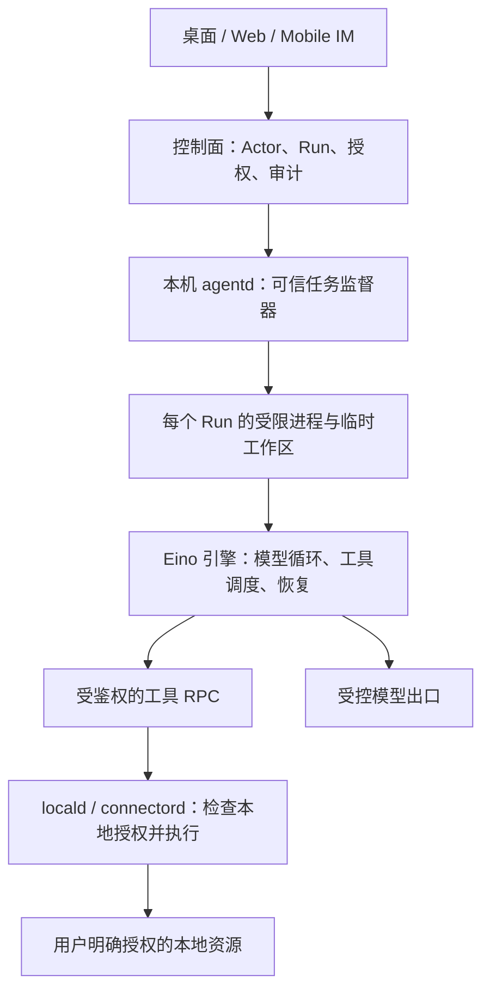

# Threadline Agent Runtime 选型调研与建议

调研日期：2026-09-15。状态：选型提案，不代表已接入、已通过安全验收或改变现有 FrozenScope。任务：[#207](https://github.com/monkeylabx/threadline/issues/207)。

## 调研方法与证据边界

仅使用项目官方代码仓库、许可证和官方文档。下述链接中 `main` 与在线文档是调研时读取的动态来源，不能作为后续发布的版本锁定。实际 Spike 必须记录 release/tag、commit、二进制摘要和配置快照，并逐平台重测。本文没有实际运行候选 Runtime，也没有完成漏洞审计；“支持”指官方明确提供的机制，“建议”指结合 Threadline 需求的判断。

## 推荐方案与当前基线

**建议：Threadline 自研薄 `agentd` 控制层，以 Eino 作为通用 Agent 引擎首选候选，配合 sandbox-runtime 复用本机隔离。Codex App Server 作为完整 Runtime 对照和编码任务候选。先完成短期对照验证，再冻结实现；不要同时开发两套生产引擎。** 这是结合 Go 技术栈、通用企业 IM、多模型和本机授权需求的工程判断，不是已经测得的安全排名。

现有 [PRD 第10节](../product-requirements.md#10-与现有-agent-core-的关系)记录自有 `agent-core` 有 Run/Step、状态、事件、文件审批、Artifact、Usage 和通用子进程能力，但缺取消、多轮 Agent loop、服务 API、Capability 强制执行和并发写锁；同文还记录固定临时文件/无锁 JSONL 的限制。这些是**项目文档陈述**，本次未取得该库源码独立复核；当前仓库的 [agentd](../../services/agentd/main.go) 仍为空入口，[Go依赖](../../services/go.mod) 未引用它。组织可见仓库中未找到准确来源，不能将它误认为 AWS Bedrock AgentCore，亦不能据此假定其许可证。

[客户端 ADR](../adr/0001-client-platform.md)、[信任边界](../security/trust-boundaries.md)已规定 locald/agentd/connectord 分离、独立 OS 身份、最小文件权限、Run 沙箱、短期 Context 和路径校验。因此这次不是重新发明这些边界，而是选择现成组件落实它们。[Frozen Scope](../acceptance/scope.md)仍写自有 agent-core、Hermes 仅参考；本文不修改它，替换/封装方案要形成后继架构决定。

## 开源候选与可复用范围

### Codex CLI / App Server：完整桌面执行 Runtime 候选

- Codex 仓库采用 Apache-2.0。App Server 提供可嵌入自己产品的 JSON-RPC 接口，默认通过子进程 stdio 传输；提供线程、轮次、执行事件和审批请求。它不要求 Threadline 使用 Codex 的桌面 UI。[许可证](https://github.com/openai/codex/blob/main/docs/license.md)、[App Server](https://developers.openai.com/codex/app-server)
- 官方明确说明沙箱覆盖派生的命令；macOS 使用 Seatbelt，Linux/WSL 使用 bubblewrap 体系，原生 Windows 有独立沙箱实现。这使它成为复用跨平台执行隔离的候选，而不只是模型编排库。[沙箱](https://learn.chatgpt.com/docs/sandboxing)
- Provider 配置有自定义模型提供方和 API 地址，不应简单标成“只能用 OpenAI”；但不能据此推断任意模型都兼容其工具调用、上下文和协议。需按企业所需 Endpoint 验证。[配置参考](https://learn.chatgpt.com/docs/config-file/config-reference)
- 接入限制：部分动态工具、权限和网络接口标为 experimental；本地 WebSocket 之外的监听有额外认证要求。建议只采用 stdio，锁版本生成 schema，并把 Runtime 的审批映射到 Threadline 的授权记录。外部 MCP 或客户端执行的动态工具不因接入协议就自动继承命令沙箱，必须单独纳入信任边界。[App Server 协议、审批与动态工具](https://developers.openai.com/codex/app-server)

**适合性判断：**适合作为“尽快复用完整桌面 Agent 执行能力”的首批 Spike 候选。需要重点验证：内置文件工具能否限定到 Connector 提供的工作区；策略能否不受用户目录/项目配置放宽；是否能关闭不需要的插件和工具；企业模型兼容；取消后子进程与后续副作用是否终止。未经这些验证，不直接选为生产默认。

### Anthropic sandbox-runtime：独立沙箱组件候选

- `anthropic-experimental/sandbox-runtime` 当前跳转到 `anthropics/sandbox-runtime`，Apache-2.0，仍标记 Beta Research Preview。它是可包装任意进程的 CLI/TypeScript 库，不负责 Agent loop、业务授权或聊天上下文。[官方仓库与许可证](https://github.com/anthropics/sandbox-runtime)
- 官方 README 已包含 macOS Seatbelt、Linux bubblewrap 和 Windows 专用本地账户/WFP/ACL 实现，并说明限制作用于整个进程树。不能继续沿用“Windows 不支持”的旧结论。[平台实现](https://github.com/anthropics/sandbox-runtime#how-it-works)
- **默认读权限不是工作区白名单**：读访问默认广泛允许，写与网络默认拒绝。Threadline 必须显式收紧读目录，再放行任务输入；不能把 README 的默认配置当作企业数据隔离策略。允许本地套接字、弱化隔离等开关同样需要固定策略。[配置与默认值](https://github.com/anthropics/sandbox-runtime#configuration)

**适合性判断：**若保留自有 `agent-core` 或使用轻量编排框架，这是最有针对性的隔离复用候选。优势是模型无关，不需要把整个 IM 改成编码产品；代价是我们仍需提供 loop、审批映射、任务状态、资源限制和生命周期管理。Windows 安装/账户权限、macOS 分发、Linux namespace 可用性必须实机验收。不得在隔离初始化失败后自动回退为普通宿主进程。

### OpenHands Software Agent SDK：完整 Agent + 容器工作区候选

- Software Agent SDK 是独立的 MIT 许可 Python 项目；不要把其许可证推断到 OpenHands 商业服务或所有其他仓库。[SDK](https://github.com/OpenHands/software-agent-sdk)、[许可证](https://github.com/OpenHands/software-agent-sdk/blob/main/LICENSE)
- SDK 使用 LiteLLM 做模型 Provider 抽象，适合多家模型和自托管 Endpoint 的适配；具体工具能力和模型质量仍需验证。[LLM 架构](https://docs.openhands.dev/sdk/arch/llm)
- OpenHands 提供 Docker 沙箱，Agent Server 在容器内执行；宿主卷挂载配置直接决定数据暴露范围。SDK 的可运行性与启用容器隔离是两件事，不能把本地工作区模式视为沙箱。[Docker Sandbox](https://docs.openhands.dev/openhands/usage/sandboxes/docker)、[Runtime 架构](https://docs.openhands.dev/openhands/usage/architecture/runtime)
- SDK 提供确认策略和安全分析器，但官方明确指出 `conversation.execute_tool()` 会绕过分析器和确认策略。这说明需要约束直接调用入口，模型风险评分也不能替代 OS 隔离。[Security & Action Confirmation](https://docs.openhands.dev/sdk/guides/security)

**适合性判断：**更适合企业自托管 Worker、远端隔离项目任务，或本来就接受容器依赖的开发者场景。普通 IM 桌面若要求额外 Docker/镜像管理，安装、更新和资源成本更大，这是本项目的部署判断。可留作远端 Runtime 候选，不建议第一版把它作为所有用户必装的本地核心。

### Claude Agent SDK：商业 Runtime 适配器候选，不归类为完整开源替代

- Python SDK 包装层有 MIT LICENSE，但默认打包并调用 Claude Code CLI；README 和官方概览同时明确商业条款。不能因为 SDK 仓库开放就把完整 Claude Code 执行引擎称为开源。[SDK README](https://github.com/anthropics/claude-agent-sdk-python)、[SDK LICENSE](https://github.com/anthropics/claude-agent-sdk-python/blob/main/LICENSE)、[Claude Code LICENSE](https://github.com/anthropics/claude-code/blob/main/LICENSE.md)
- SDK 提供现成 loop、工具、会话、hooks、subagents 和 MCP；支持 Python/TypeScript，其他语言可用 CLI 子进程。它可减少编排开发，但默认工具集包含文件与 Bash，`allowed_tools` 是自动批准名单，不是隐藏所有未列出工具的白名单。[概览](https://code.claude.com/docs/en/agent-sdk/overview)、[工具配置语义](https://github.com/anthropics/claude-agent-sdk-python#using-tools)
- Claude 有不同云平台部署通道，不能把它等同于任意厂商模型的通用 Runtime；SDK 的安全部署文档仍要求选择隔离环境，并建议在隔离边界外持有凭据，通过受控代理注入。[企业部署](https://code.claude.com/docs/en/bedrock-vertex-proxies)、[安全部署](https://code.claude.com/docs/en/agent-sdk/secure-deployment)

**适合性判断：**适合企业明确选用 Claude 时的可选适配器。开源可审计、多模型中立、离线可分发若是核心要求，不把它当作唯一底座。商业使用与分发条件需在选定集成方式后另行确认，本文不构成许可法律意见。

### Eino：通用 Go 引擎首选候选

Eino 为 Apache-2.0 Go 框架，提供模型/工具抽象、多 Agent、并行执行、Interrupt/Resume 和检查点；官方组件覆盖多种模型提供方。其 filesystem middleware 定义 Backend 以及可选 Shell/StreamingShell，不提供 Shell 时不注册 execute 工具。这是接 Threadline Connector 与安全执行后端的合适接口，不必重写 Agent loop。[官方仓库](https://github.com/cloudwego/eino)、[概览](https://www.cloudwego.io/docs/eino/overview/)、[文件接口](https://www.cloudwego.io/docs/eino/core_modules/eino_adk/eino_adk_chatmodelagentmiddleware/middleware_filesystem/)

不要直接启用官方 Local Backend 来处理不可信指令：它访问本地文件系统，命令验证回调不是 OS 隔离。官方也提供 Ark Agentkit 远端沙箱适配器，说明可复用后端接口，但其云端数据流和服务依赖不适合作为 Threadline 本机默认。应实现自身 Connector RPC Backend 和选定的本地隔离适配器。[Local Backend](https://www.cloudwego.io/docs/eino/core_modules/eino_adk/eino_adk_chatmodelagentmiddleware/filesystem_backend/backend_local_filesystem/)、[Ark Backend](https://www.cloudwego.io/docs/eino/core_modules/eino_adk/eino_adk_chatmodelagentmiddleware/filesystem_backend/backend_ark_agentkit_sandbox/)

**适合性判断：**最贴合当前 Go 栈与非编码类企业任务。它复用编排而非自动解决宿主隔离；与 SRT 的组合在本次尚未实际验证。Checkpoint 可恢复流程，不自动保证外部文件写入/发布恰好一次，副作用需要 Threadline 操作ID和幂等回执。

### 其他候选：保留明确适用范围

| 候选 | 一手来源事实 | 对 Threadline 的判断 |
| --- | --- | --- |
| Google ADK Go | Apache-2.0；Go、模型/部署无关、多 Agent；安全文档分别讨论应用权限和代码执行沙箱。当前主线已有 /v2，选型需固定版本。[仓库](https://github.com/google/adk-go)、[安全](https://adk.dev/safety/) | Go 引擎第二候选；不能将其他语言或云托管沙箱的能力自动归给本机 Go 实现 |
| LangGraph | MIT；持久化、checkpoint、人工中断；Python/JS 生态。[仓库](https://github.com/langchain-ai/langgraph)、[持久化](https://docs.langchain.com/oss/python/langgraph/persistence) | 适合复杂状态工作流，但为 Go 桌面引入额外运行环境；并非 OS 沙箱 |
| Pi | MIT；TS SDK/JSONL RPC、多模型和会话；官方安全政策明确不提供沙箱，扩展拥有用户级系统访问。[仓库](https://github.com/earendil-works/pi)、[安全政策](https://github.com/earendil-works/pi/blob/main/SECURITY.md) | 可嵌入但不能以安全 Runtime 名义直接采用；仍需完整外部隔离 |
| Hermes | MIT，多模型/自定义 Endpoint、多种终端后端；默认 local 无隔离，Docker 默认持久容器跨 session/subagent 共享，需 container_persistent:false 才按 session 分离。[仓库](https://github.com/NousResearch/hermes-agent)、[配置](https://hermes-agent.nousresearch.com/docs/user-guide/configuration) | 完整个人助理的记忆/网关/技能与 IM 重叠；借鉴而非原样嵌入。只读挂载凭据依然能泄露，[Docker挂载](https://hermes-agent.nousresearch.com/docs/user-guide/docker)需审查 |

## 比较结论（待 Spike 验证）

| 路线 | 主要复用 | Threadline 必须保留 | 主要取舍 |
| --- | --- | --- | --- |
| Codex App Server | 完整 Agent loop、执行事件、审批接口、原生沙箱 | Actor/Run 授权、ContextScope、Connector 权限、数据发布控制 | 快速整合；内置行为、协议版本和模型兼容需验证 |
| 薄 agentd + Eino + sandbox-runtime（主方案候选） | Eino loop/恢复/工具接口 + SRT OS 隔离 | 业务授权、取消映射、审批与幂等回执、资源预算 | 模型中立且贴合 Go；组合与平台分发需验证 |
| OpenHands SDK + Docker Sandbox | Agent loop、多模型、容器工作区、确认策略 | 企业授权、卷/网络策略、凭据与控制面 | 适合远端 Worker；普通桌面部署偏重 |
| Claude Agent SDK | Claude loop、工具、会话与 hooks | 产品授权、隔离部署、凭据代理 | 完整引擎非全开源；适合可选厂商集成 |

这些判断不等于四者安全等级排名。OS 沙箱、模型行为、第三方工具权限和 Threadline 的企业授权是不同责任：选对 Runtime 能复用前两类中的一部分机制，但不会自动获得组织、频道和本地目录的授权语义。

## 建议接入架构

以下为拟议设计，不是当前实现。保留 IM / 控制面 / Runtime / Connector 四个边界；IM 不依赖模型进程存活。

这里的“受限进程”首选验证 SRT；只包裹 Bash 不够，引擎进程和允许加载的插件同样应在隔离范围内。可信监督器不加载任意第三方插件、不执行模型生成的代码。沙箱只获得运行必需文件、当前 Run 的输入副本及输出目录，不获得用户 HOME、IM 数据库、浏览器配置或整盘读取权限。SRT 本身不是 VM；本方案不声称能抵御宿主内核或管理员已经失陷。

具体责任划分：

| 层 | 实现内容 | 复用或自研 |
| --- | --- | --- |
| Agent 引擎 | 多轮工具调用、模型适配、流程恢复 | 优先复用 Eino；不自写全功能框架 |
| 进程执行边界 | 文件与网络限制、子进程继承隔离 | 优先复用 SRT；资源配额与进程回收另行验证/补齐 |
| Run 监督器 | 创建、取消、超时、重启恢复、事件归一化、预算 | 薄自研 agentd；复核现有 agent-core 可复用部分 |
| 产品权限 | Actor、组织/频道范围、ContextScope、审批、撤销 | Threadline 自研，所有 Runtime 共用 |
| 本地工具 | 路径/资源验证、授权检查、敏感动作执行、幂等回执 | Connector；不向引擎开放通用宿主 shell |
| UI 与同步 | 脱敏后的状态、审批摘要、产物引用 | IM 原有体系；避免上传原始私有工作区/完整推理日志 |

**一次文件任务的执行方式：**用户授权目录和任务用途 → 控制面下发限定 Run 的能力 → 本机再与用户当前本地授权取交集 → Connector 提供必要输入 → 引擎生成结果写入临时输出 → 若涉及覆盖、删除或外发，提交绑定具体资源与参数的审批 → Connector 验证批准仍有效后提交副作用并返回回执。服务器的授权不能扩大本机授权，读文件的许可也不能自动变成向任意模型/网站上传的许可。

本机 RPC 必须鉴权并校验 Run、能力、到期时间与撤销状态，不能因为调用来自 localhost 就信任。Capability 限定对象与操作；它不是拥有全部 Connector 权限的长期 bearer token。审批绑定规范化参数/内容版本，参数变化必须重新审批；重试以 operation ID 去重，不能仅靠框架 checkpoint 保证副作用不重复。

模型密钥保存在隔离边界外，通过受控本地模型出口或等效机制注入；该出口只允许需要的模型 API 操作，不变成任意代理。其实现不得改变既有数据驻留要求，不意味着服务器中转所有提示词。Run 环境使用独立 HOME/配置/缓存，关闭非必要遥测和自动加载项目插件；Runtime 的会话历史、检查点和崩溃日志服从 Threadline 的保留/清理规则。

Web/Mobile 仅操作 IM 和被授权的运行入口。它们访问用户电脑必须经在线且已授权的本地 Connector；没有 Connector 时明确显示能力不可用，IM 仍可聊天。未来远端 Worker 可采用 OpenHands，但不能因此获得客户端本地文件权限。

## 怎样决定复用完整 Runtime 还是薄自研

推荐先做同一任务集的 **Eino + SRT / Codex App Server 对照 Spike**，而非先造完整 runtime 再比较。通用样例包括：授权文件摘要、调用企业工具后等待审批、取消长任务，以及断线恢复后防止重复写入。

- 若 Eino 路线通过隔离、模型兼容和生命周期验收，保留为通用默认；维护范围限定在监督器、授权和 Connector 适配。
- 若 Codex 同样通过严格读隔离、工具禁用、企业模型、历史清理和分发验证，且显著减少上述维护范围，可改选它为默认，或仅为明确需要编码的任务提供适配器。不能只因一次编码演示成功就选定。
- 若 SRT 在某个平台无法满足隔离要求，该平台的本地执行暂不发布；评估受限远端 Worker 或其他成熟隔离后端。不能自动关闭沙箱继续运行，也不在本轮自研 OS 沙箱。
- 自有 agent-core 先取得源码、许可证与实际依赖图。可复用已验证的事件/状态/产物契约；是否沿用执行实现由取消、并发写入、权限强制执行证据决定。PRD 描述不足以证明实现安全。

## 后续任务与验收

这些是待领取的任务建议，不是已完成实现；每项独立 Issue、独立 ownership。跨组件接口先形成文档/Protobuf 合同，由集成负责人处理共享协议面。

| 顺序 | 有界任务 | 预计工作量 | 可评审交付 |
| --- | --- | --- | --- |
| 1 | agent-core 源码核验与接口草案 | 0.5–1 天，源码可得后 | 来源/许可证、Run 生命周期、工具 RPC、审批/撤销/事件契约 |
| 2 | Eino + SRT 最小纵向验证 | 1–2 天 | 一个授权输入任务，含审批、取消；固定版本与运行记录 |
| 3 | Codex App Server 同任务对照 | 1–2 天 | stdio 适配、工具范围、所需模型 Endpoint 验证与差异表 |
| 4 | 各目标 OS 的隔离/分发验证，逐平台拆单 | 每平台 1–2 天 | 包装/安装要求、文件/网络/进程测试证据与失败模式 |
| 5 | 撤权、恢复和恶意输入验收 | 1–2 天 | 可重复的负向测试及审计回执 |
| 6 | 选型 ADR 和实施任务拆分 | 0.5–1 天 | 一个默认引擎、锁定版本、剩余风险与 Frozen Scope 变更建议 |

估算仅用于安排研究验证，不是生产交付承诺。首轮纵向验证只使用临时测试目录、测试凭据与假企业工具，不能以真实用户 HOME 作为测试工作区。

生产选型必须有以下实际证据，当前均尚未执行：

1. **文件隔离：**普通读取、命令、子进程、插件均无法读取测试版 SSH 密钥/浏览器凭据/IM 数据库；覆盖符号链接、路径替换、继承文件描述符和跨 Run 工作区。必要的运行时库可读不代表用户目录可读。
2. **网络与凭据：**非授权域名、直接 IP、重定向、DNS 与继承 socket 等路径不能绕过既定出口规则；工具进程拿不到模型主密钥。模型出口不能访问未授权 API。授权模型收到哪些本地数据有明确范围。
3. **审批不可绕过：**直接工具调用、恢复、并行子任务、MCP 和参数篡改都经过同一授权入口；拒绝/撤销后不产生副作用。
4. **生命周期：**取消、超时、退出后所有后代进程终止，过期回调不再写入；checkpoint 恢复不重复提交已完成动作。验证 CPU/内存/磁盘限制及恶意输出造成的资源消耗。
5. **状态与隐私：**不同 Run 不共享会话历史和可写缓存；日志不含密钥，私有内容按保留策略清理；断网、模型失败、沙箱启动失败时 IM 继续工作。
6. **分发：**目标 OS 上可安装/升级/卸载，隔离策略不可由项目配置放宽；锁定 release、commit、二进制摘要和依赖，验证更新来源。不能用源码主线“支持”替代安装包验证。

## 调研源码快照

以下是调研时取得的仓库 HEAD，用于追溯来源；不是经测试的生产版本。在线文档可能独立更新，实施时需重新核验与版本对应关系。

| 仓库 | 调研 commit |
| --- | --- |
| openai/codex | [`7784318b5f7f`](https://github.com/openai/codex/tree/7784318b5f7fa35728d41ffa13e2a5821ebb4d75) |
| anthropics/sandbox-runtime | [`9c6d356c6963`](https://github.com/anthropics/sandbox-runtime/tree/9c6d356c6963d5a1ff7b9cad3060288d74d514f2) |
| cloudwego/eino | [`9d983b36a511`](https://github.com/cloudwego/eino/tree/9d983b36a5112a1c233056b1a099825298fafb8f) |
| OpenHands/software-agent-sdk | [`b054a2fe9917`](https://github.com/OpenHands/software-agent-sdk/tree/b054a2fe99173baee47897e4f3af7a910d3aab1e) |
| NousResearch/hermes-agent | [`78d338b9ee91`](https://github.com/NousResearch/hermes-agent/tree/78d338b9ee917b73468c38ba4633ed53de4942e6) |
| earendil-works/pi | [`8a7b0c03dfb7`](https://github.com/earendil-works/pi/tree/8a7b0c03dfb702663acafb6dc29f8acaa4ffe391) |
| google/adk-go | [`f7e16e0226d8`](https://github.com/google/adk-go/tree/f7e16e0226d8a255e39543df2fdfc0e15041de51) |
| langchain-ai/langgraph | [`230927fb3a9a`](https://github.com/langchain-ai/langgraph/tree/230927fb3a9ac9b2893a30322b4dfea7cdea9a8f) |
