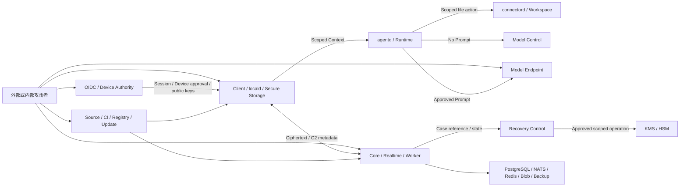

# Threadline Private Enterprise v1.0 威胁模型

状态：M0 STRIDE 基线草案

日期：2026-08-04

Issue：#21

关联：`docs/acceptance/scope.md`、`docs/security/data-classification.md`、`docs/security/trust-boundaries.md`、`docs/adr/0001-client-platform.md`、`docs/adr/0002-server-protocol-storage.md`、`docs/adr/0003-group-e2ee-recovery.md`、`docs/security/risk-register.md`

## 1. 结论与安全目标

Threadline 的主要安全风险不来自单一服务，而来自跨域授权被混淆：OIDC Session 被误当作 Device Credential、Channel Membership 被误当作 MLS Cryptographic Membership、Agent 身份被误当作持续解密资格、普通管理员被误当作恢复接收者，或“企业内网”被误当作天然可信。

v1 必须持续满足以下目标：

- **机密性**：消息、文件、Prompt、Workspace 内容和密钥只出现在明确获权的设备或接收方；服务端只处理密文与必要元数据。
- **身份与完整性**：Device、Actor、Agent Attribution、Membership Change、Epoch、Task/Run、Artifact 和 Recovery Case 的绑定可验证且不能跨 Tenant/Group/用途重放。
- **最小权限**：Runtime、Connector、Model Control、Recovery Control 和 KMS/HSM 使用相互独立、短期且范围绑定的身份与授权。
- **可追责**：高影响动作记录主体、对象、理由、策略版本、审批链和结果，但不记录正文、Token 或 Key。
- **恢复滥用防护**：企业恢复始终是范围绑定、多人审批、端到端交付给指定设备的高影响流程，不成为管理员搜索、Agent Tool 或模型接口。
- **可恢复可用性**：模型、Agent Runtime、Realtime、NATS 或 Redis 故障不能破坏普通 IM 的持久性；被撤销设备不能为可用性继续使用旧 Epoch 发送。
- **安全失败**：未知 Crypto Profile、损坏或乱序 Commit、权限状态不明、恢复审批不完整、模型出口不合规时拒绝或保持 Pending，不降级到明文或扩大权限。

## 2. 方法与风险口径

本模型对每个信任边界使用 STRIDE：

| 类别 | 本项目中的问题 |
| --- | --- |
| Spoofing | 能否冒充 Human、Agent、Device、Service、Model Endpoint 或审批者？ |
| Tampering | 能否替换 Ciphertext、Commit、KeyPackage、Policy、Artifact、日志或更新制品？ |
| Repudiation | 高影响动作能否被伪造、删除、归错主体或无法证明批准链？ |
| Information Disclosure | C2-C4 数据能否越过允许位置、受众、用途或 Retention？ |
| Denial of Service | 攻击者能否阻塞消息持久化、Epoch 推进、恢复、同步或本地客户端？ |
| Elevation of Privilege | 低权限 Actor、Device 或 Workload 能否取得更大资源范围、长期 Grant、群组密钥或恢复能力？ |

风险分值使用 `Likelihood × Impact`，两者均为 1-5：

| 分值 | 等级 | Gate 语义 |
| ---: | --- | --- |
| 20-25 | Critical | 立即阻断受影响能力；不能接受风险或进入下一 Gate。 |
| 12-19 | High | 能力保持关闭或受限；不得越过台账指定的启用 Gate。 |
| 6-11 | Medium | 可在 Security Owner 记录残余风险、到期日和复审条件后进入 Gate。 |
| 1-5 | Low | 由 Owner 在常规工程周期处理并保留验证证据。 |

分值衡量的是当前设计和实现证据，不因“计划以后加控制”而降低。`docs/security/risk-register.md` 是风险状态、Owner、截止 Gate 和证据的事实源。

## 3. 范围、攻击者与假设

### 3.1 范围内

- macOS、Windows、Linux Desktop，iOS、Android，以及共享 Rust Client Core、FFI、`locald`、`agentd` 和 `connectord`。
- IM Core、Realtime、Worker、Runtime Gateway、Model Control、Recovery Control、PostgreSQL、NATS、Redis、Object Storage、Observability 和备份。
- OIDC、Device Authority、Key Directory、MLS Group/Epoch、History Sharing、Recovery Case、KMS/HSM、Capability/Route/Workspace Grant。
- 企业批准的 Model Endpoint、CI/CD、依赖供应链、签名更新和离线安装包。

### 3.2 攻击者能力

- 未认证的网络攻击者，以及能控制 DNS、代理或企业网络中间节点的攻击者。
- 恶意、被停用或权限刚被撤销的 Human/Guest；拥有旧 Ciphertext、Token、KeyPackage 或离线 Device 状态。
- 丢失、越狱、Root、恶意软件感染或被完整镜像的授权 Device。
- 恶意或被 Prompt/Tool Input 操纵的 Agent、Runtime、Tool、Connector 或 Model Endpoint。
- 普通企业管理员、数据库/备份/集群操作员、内部开发者，或被攻陷的单个服务 Workload。
- 能污染依赖、生成代码、CI Runner、构建缓存、签名流程、镜像、更新 Feed 或离线 Bundle 的供应链攻击者。
- 能延迟、丢弃、重放、乱序或分叉服务端事件的故障或恶意 Delivery Service。

### 3.3 不作为安全假设

- 企业内网、同一 Kubernetes Cluster、本机 IPC 或同一用户 Session 自动可信。
- OIDC 登录自动证明 Device Identity 或授权所有设备。
- TLS、数据库加密、KMS/HSM、代码签名或 E2EE 单独解决上层授权、重放、元数据泄露和终端攻陷。
- Server 返回 ACK、Recovery 状态或 Membership 状态就代表客户端密码状态正确。
- 模型 Endpoint、普通管理员或 Agent 因“企业内部”即可获得恢复或 Channel 解密能力。

### 3.4 明确限制

- v1 不隐藏参与关系、时间、Ciphertext 长度和流量模式等必要 C2 元数据。
- 完全攻陷获权 Device 可能泄露该 Device 在 Retention 范围内仍持有的历史；系统不承诺远程物理删除被攻陷设备。
- E2EE 不防止服务端拒绝服务；Threadline 需要检测分叉和安全失败，但不能保证恶意服务端投递消息。
- Prompt 一旦按 Policy 发送到获批 Model Endpoint，该 Endpoint 成为明确的 C3 接收方；其数据使用风险由企业准入和合同控制共同承担。

## 4. 资产与信任边界

| 资产 | 等级 | 主要 Owner | 关键安全属性 |
| --- | --- | --- | --- |
| Device Identity、MLS Leaf Key、DB Key、Recovery Recipient Key | C4 | Device / Client Crypto | 独立用途、不可导出优先、可撤销、不进日志/备份 |
| Capability、Route、Lease、Workspace Grant | C4 | Control Plane / Runtime Policy | Tenant/Actor/Task/Resource/Action/Expiry/Nonce 绑定 |
| Channel/Epoch State、History Key、Content Key | C4 | Client Crypto | Group/Epoch/Profile/ACL/Retention 绑定、抗回滚 |
| 企业恢复私钥 | C4 | KMS/HSM | 应用不可导出、用途绑定、多人审批、全量审计 |
| 消息、文件、Prompt、Tool Output、Artifact 明文 | C3 | 授权域/用户 | 最小受众、最短生命周期、不进通用服务端或遥测 |
| Ciphertext、Membership、事件顺序、ACL、审计元数据 | C2-C4 | IM/Recovery Control Plane | Tenant 隔离、完整性、最小化、Retention |
| 制品、依赖、生成 SDK、更新 Manifest | C1-C4 影响 | Release / Integration | 来源、完整性、可重复构建、签名、回滚安全 |

详细允许位置和跨界数据流以数据分类与信任边界文档为准。本模型不复制那些事实，而是验证攻击者能否违反它们。

## 5. STRIDE 场景

### 5.1 身份、设备与密钥目录

| Risk | STRIDE | 场景 | 直接后果 |
| --- | --- | --- | --- |
| R-001 | S/E | 被攻陷的 Control Plane 或管理员绕过 Device Authority，静默插入“幽灵设备”。 | 攻击设备进入当前 Epoch 并持续解密 Channel。 |
| R-002 | S/E | 将 OIDC Session、刷新 Token 或普通管理员身份误当作 Device Credential。 | 登录会话可铸造密码身份或授权任意新设备。 |
| R-003 | S/T | KeyPackage 被替换、重复消费、跨 Tenant/Device 使用或绑定到错误 Crypto Profile。 | 攻击者设备被加入 Group，或客户端建立错误状态。 |
| R-004 | S/I | 设备备份、迁移或克隆恢复 Device Identity、Leaf Key 或未消费 KeyPackage 私钥。 | 一个 Device 身份在多个硬件上并行存在且无法准确撤销。 |

### 5.2 MLS、消息、历史与同步

| Risk | STRIDE | 场景 | 直接后果 |
| --- | --- | --- | --- |
| R-005 | T/S/D | Commit、Welcome 或 Proposal 被跨 Group/Epoch 重放、替换、乱序或向设备分叉。 | 成员视图分裂、错误设备加入、消息不可解密或降级到不安全状态。 |
| R-006 | E/I | 移除 Member/Device 后继续用旧 Epoch 发送，或服务端跳过 `rekey_required`。 | 被撤销设备读取未来消息。 |
| R-007 | E/I | History Sharing、Device History Sharing 或窄对象 ACL 只复检服务端 Membership。 | 新成员、错误设备或非对象受众获得保留历史/文件。 |
| R-008 | I | 获权 Device 被完全攻陷并导出 Retention 范围内 History Key、本地索引和缓存。 | 仍保留的历史被批量解密。 |
| R-009 | T/E | 客户端接受未知/旧 Crypto Profile、持久化快照回滚、库版本替代 Wire Version 或静默降级。 | 密码状态回滚、旧漏洞复活或跨版本解释不一致。 |
| R-010 | S/R/T | 客户端任意填写 `agent_actor_id`、Task/Run/Grant 或修改 Artifact Provenance。 | 人类设备伪造 Agent 行为，审计和审批归错主体。 |
| R-011 | E/I | Tenant、Channel、Object、Cursor 或 Membership IDOR，或缓存授权未按当前 ACL 复检。 | 跨 Tenant/Channel 读取密文、元数据、文件或 History Sharing。 |
| R-012 | T/R | Server 在 PostgreSQL 未满足持久条件前 ACK，或重复 Event 破坏幂等/顺序。 | 客户端误删 Outbox、消息丢失、事件状态不可追责。 |
| R-013 | I | Ciphertext 关系元数据、文件名、Snippet、Token、Key 或明文进入日志、Trace、Crash Dump、诊断包或备份。 | C2-C4 数据绕过访问与 Retention 边界。 |
| R-014 | D | 攻击者耗尽 KeyPackage、制造 Commit 冲突、热点 Channel、慢客户端或长期 `rekey_required`。 | Group 无法推进 Epoch 或普通 IM 不可用。 |

### 5.3 企业恢复

| Risk | STRIDE | 场景 | 直接后果 |
| --- | --- | --- | --- |
| R-015 | E/I | Core、Agent、Model Control、普通管理员或被攻陷 Workload 直接调用 KMS/HSM 恢复能力。 | 日常服务获得通用解密路径。 |
| R-016 | S/T/R | 请求者自批、复用旧审批、替换审批者/对象/原因/TTL，或删除失败尝试。 | 未授权或无法追责的 Recovery Case 被执行。 |
| R-017 | T/I/E | Recovery Envelope 跨 Tenant/Group/Epoch/Key Version 替换，Case 范围过宽，输出交付错误设备或成为搜索/Agent API。 | 恢复越权、批量浏览或可复用解密材料泄露。 |
| R-018 | D/T | Recovery Key 被错误销毁、轮换记录丢失、HSM/审计不可用，或备份恢复破坏 Envelope/Key Version 关系。 | 合规范围内历史永久不可恢复或恢复结果不可信。 |

### 5.4 Runtime、Connector 与模型出口

| Risk | STRIDE | 场景 | 直接后果 |
| --- | --- | --- | --- |
| R-019 | E/S | Capability 未绑定 Tenant/Actor/Task/Resource/Action/Expiry/Nonce，或被另一 Runtime/Run 重放。 | Agent 读取超范围 Context 或执行未授权动作。 |
| R-020 | I/E | Runtime/Agent Mount IM SQLite、调用未授权 Context API、保留完整 Transcript 或通过 Tool Output 外泄。 | Channel 历史和本地密钥边界失效。 |
| R-021 | E/T/I | Connector 利用 `..`、符号链接、挂载点、大小写/Unicode、TOCTOU 或任意执行越过 Workspace Grant。 | 读取、覆盖或执行 Grant 外文件。 |
| R-022 | T/R/E | 高影响动作在批准后改变参数/目标，批准人看到的内容与实际执行不一致，或执行结果不可审计。 | 删除、覆盖、外发等动作越权且无法归责。 |
| R-023 | S/E/I | Model Endpoint 被冒充，Fallback 绕过区域/保留/模型 Policy，或 Route Grant 可用于其他 Prompt/Endpoint。 | C3 Prompt 发往未批准接收方。 |
| R-024 | I | Prompt、模型响应、Tool Secret、stdout/stderr 或完整 Artifact 进入 Model Control、Runtime Gateway、日志或长期 Session。 | C3/C4 数据在非接收域持久泄露。 |

### 5.5 服务、运维与供应链

| Risk | STRIDE | 场景 | 直接后果 |
| --- | --- | --- | --- |
| R-025 | E/I | 共享 ServiceAccount、数据库 Role、NetworkPolicy 或 Secret 允许 Workload 横向访问 Recovery、Model、Blob 或 Domain 数据。 | 单服务攻陷升级为跨信任域攻陷。 |
| R-026 | T/E | 恶意依赖、构建脚本、CI Runner、镜像、OpenMLS feature、更新 Feed 或离线 Bundle 注入代码/密钥窃取。 | 所有端点或服务被供应链接管。 |
| R-027 | T/R | Protobuf/FFI/生成 SDK、Golden Frame 或 Schema 在平台间漂移，未知字段被丢弃。 | 客户端以不同授权/密码语义处理同一事件。 |
| R-028 | T/I | Retention 时钟/策略/本地快照被回滚，离线 Device 不删 Key/索引，Tombstone 或备份到期未执行。 | 已到期或已撤权内容继续可解密/检索。 |
| R-029 | T/R | 审计事件可删除、重排、覆盖、跨 Tenant 注入，或记录正文/Secret。 | 高影响动作既不可证明又造成新的数据泄露。 |
| R-030 | D/E | Model、Agent Runtime、NATS、Redis、Realtime 或 Recovery 故障被同步耦合到 Core 消息提交与本地历史。 | 非关键子系统故障使普通 IM 停止或诱发不安全绕过。 |
| R-031 | I/T/E | Client Scan Hook 在附件加密前保留、外发或修改明文，或扫描后文件被 TOCTOU 替换。 | 文件在 E2EE 前泄露，或扫描结论与实际上传内容不一致。 |

## 6. 强制安全不变量

以下断言必须落实为 Contract、Policy 或自动化负向测试，不能只依赖代码评审：

1. 普通 IM Server、Runtime、Agent、Model Control、Model Endpoint 和普通管理员身份均不能调用恢复私钥操作。
2. 第一台 Device 需要 Device Authority；后续 Device 需要现有 Device 或独立高影响审批，Control Plane 不能单独增加 MLS Leaf。
3. Membership Change 由服务端授权和排序，MLS Commit 由当前获权 Device 生成并由客户端验证。
4. 移除或撤销触发 `rekey_required`；successor Epoch 前的新消息只保留在 Local Outbox。
5. History/Recovery/Object Envelope 绑定 Tenant、Group、Epoch、Crypto Profile、Key Version、对象范围和接收设备。
6. Agent Attribution 绑定 Device Identity、Agent、Task、Run、Grant、Ciphertext 和 Provenance，任一字段改变都验证失败。
7. Capability/Route/Workspace Grant 每次使用时按当前 Policy 复检，并绑定调用方、资源、动作、TTL 和防重放字段。
8. Runtime 不直接打开 IM DB；Model Control 和 Runtime Gateway 的 Contract 不含 Prompt/正文透传字段。
9. 持久 ACK 只在 Ciphertext Event、Channel Sequence 和 Transactional Outbox 同一数据库事务达到持久条件后返回。
10. 未知 Crypto Profile、版本、持久化字段或恢复状态安全失败，不静默降级或丢弃后继续。
11. C3/C4 数据不进入普通日志、Trace、Crash Dump、诊断包、共享卷、环境变量或客户端 UI DTO。
12. 模型和 Agent 子系统离线不会改变消息事实源、E2EE 或本地历史可用性。

## 7. 验证与 Gate

| Gate | 必须提供的安全证据 |
| --- | --- |
| M0 / 2026-08-21 | Threat/Risk 基线、RFC 9420/Golden Vector、Commit/Fork/Replay/未知 Profile、Recovery/History 负向向量、FFI 最小 Harness。 |
| M1 / 2026-09-18 | 可重复构建、SBOM、依赖/Secret Scan、Keychain/Keystore Adapter、OIDC 与 Device Credential 分离、Proto Breaking/Golden Frame。 |
| M2 / 2026-11-13 | E2EE 消息垂直切片、Durable ACK/Outbox、Agent Attribution、Runtime 故障隔离、跨 Tenant 与撤权测试。 |
| M4 / 2027-03-19 | Capability/Route/Workspace Grant、Connector 逃逸、高影响审批 TOCTOU、Prompt Egress 和 Tool Output 清理测试。 |
| M5 / 2027-05-21 | Recovery Control 隔离、双人审批、KMS/HSM Policy、恢复输出交付、Retention/Backup/Restore 和不可变审计演练。 |
| M6 / 2027-07-23 | 五平台 E2E、SLO/Load/Chaos、升级回滚、故障注入、日志/诊断/共享卷扫描。 |
| M7 / 2027-09-03 | 独立 Crypto Review、Pentest、供应链复审；所有 Critical/High 风险满足关闭标准。 |

### Critical/High 关闭标准

Critical 或 High 只有同时满足下列条件才能标记 `Closed`：

- 控制已进入可获取的 Commit/制品/Policy，不以未提交状态或口头计划作为证据。
- 至少一个自动化负向或对抗测试能在移除控制时失败，并在所有受影响平台/服务通过。
- 验证覆盖撤权、重放、乱序、跨 Tenant、故障或恢复路径中的相关场景。
- 日志、Trace、诊断包和审计字段经过内容/Secret Review，未引入新的 C3/C4 泄露。
- Security Reviewer 复核证据、剩余攻击路径和残余分值；残余风险降到 Medium 或 Low。
- Risk Register 记录证据链接、关闭人、关闭日期和重新打开条件。

Critical 不允许风险接受。High 在对应能力尚未启用时可以保持 `Open`，但不能越过其 Due Gate；M7 前不存在以“业务接受”代替关闭的 Critical/High。

## 8. 复审触发条件

出现以下变化时，Security Owner 必须更新本模型和风险台账，并决定是否重开 Scope/ADR：

- 新增服务端明文搜索、DLP、摘要、Prompt 代理、Enterprise Runner 或严格不可恢复 Channel。
- Agent、Service、Model Control、Runtime Gateway、普通管理员或 Core 获得 Channel Key/Recovery Key 能力。
- 修改 Device Authority、MLS Group/Member/Epoch、History Key、Recovery Envelope、Crypto Profile 或 Retention 语义。
- 引入新模型供应商、Tool/Connector 类型、跨 Region Active-Active、共享数据库写入或跨 Tenant 数据迁移。
- 更换 OpenMLS/Crypto Provider、FFI/更新系统、KMS/HSM、身份提供商或制品签名根。
- 发生密钥、Prompt、Workspace、恢复、供应链或跨 Tenant 安全事件，或发现 Critical/High 新路径。
