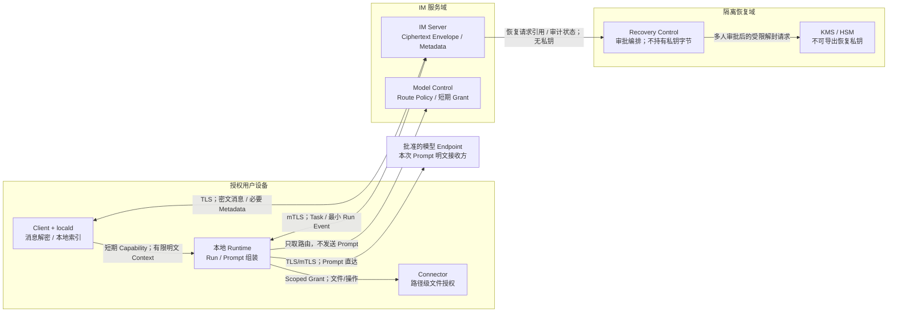

# Threadline 信任边界与数据流

状态：M0 安全基线草案

适用范围：Private Enterprise v1.0

Issue：#20

## 1. 核心结论

Threadline 将 IM 协调、恢复权限、本地执行、文件访问和模型推理拆成独立信任域。网络位于企业内网不代表
自动可信；每次跨界都必须同时校验身份、Tenant、资源、操作、有效期和当前 Policy。

禁止路径：`IM Server -> Prompt`、`Model Control -> Prompt`、`Runtime -> IM DB`、
`Connector -> IM DB`、`任意应用服务 -> 恢复私钥`、`共享卷 -> 客户端明文历史`。

## 2. 信任域

| 信任域 | 可以接触 | 明确不能接触 | 主要控制 |
| --- | --- | --- | --- |
| Client / `locald` | 用户可访问的消息/文件明文、本地密文库、Cursor、Outbox、索引；使用设备密钥 | 其他用户/设备数据；企业恢复私钥；任意 Workspace | 设备身份、OS Secure Storage、整库加密、单 Writer、当前 ACL 复检 |
| IM Server（Core/Realtime/Worker/Runtime Gateway） | Ciphertext Envelope、必要 Metadata、Task/Approval/Capability 状态、最小 Run Event | 消息/文件正文、Prompt、Workspace、Channel/Epoch Key、恢复私钥 | mTLS、Tenant 隔离、RBAC/ACL、Transactional Outbox、字段级日志策略 |
| Recovery Control | 恢复 Case、审批、对象引用、封装材料、解封结果交付状态 | 可导出的恢复私钥；日常消息查询；模型或 Agent 调用入口 | 独立网络/IAM/部署、多人审批、用途与范围绑定、不可变审计、KMS/HSM 内运算 |
| 本地 Runtime / `agentd` | 当前 Task、有限 Context、Run 状态、工具输出、Prompt；短期 Capability/Route Grant | IM SQLite、完整 Channel 历史、恢复私钥、未授权文件 | 主动 mTLS 连接、Capability、Lease/Fencing、Run Sandbox、短期 Context 清理 |
| Connector / `connectord` | Grant 指定路径和操作、最小操作日志 | IM DB、Channel Key、Prompt、Grant 外路径、用户长期凭据 | 本机 IPC 身份、路径规范化、防符号链接逃逸、Sandbox、高影响操作审批 |
| Model Control | Model Registry、能力/健康/评分、Route Policy、Endpoint 和短期路由凭据 | Prompt、模型响应正文、消息/文件明文、恢复私钥 | Policy Decision、短期绑定 Grant、Secret Manager、只记录路由元数据 |
| 模型 Endpoint | 本次批准调用的 Prompt、必要工具回合和响应 | Channel Key、恢复私钥、整个 IM DB、超出 Task 的历史 | 企业准入、数据驻留/保留策略、TLS/mTLS、Endpoint 级审计、禁训练/禁留存配置 |

Recovery Control 是隔离权限域，即使早期部署暂以受控模块或外部企业流程实现，也不得把它折回 Core 的
普通管理员 API 或复用 Core 的服务身份。

## 3. 跨界数据流

### 3.1 消息发送与同步

1. `locald` 在设备上生成事件、以 Channel/Epoch Key 加密，并先写 Durable Local Outbox。
2. Client 经 TLS/WSS 发送 Ciphertext Envelope；Realtime 只做连接级校验并交给 Core。
3. Core 复检 Membership/Signature/Policy，分配 `channel_seq`，将密文事件和 Outbox 原子提交。
4. Server/Worker 只路由密文和必要 Metadata。接收设备同步后在本地获权解密、物化和索引。

边界条件：Durable ACK 不证明 Server 看过明文；Server 不接受正文、Snippet、FTS Token 或客户端 DB
文件作为同步负载。每台设备维护独立数据库，禁止通过共享卷或同步 SQLite 文件实现多端同步。

### 3.2 Runtime 读取 Context

1. IM Control Plane 为 Actor、Task、Resource、操作和 Expiry 绑定短期 Capability。
2. Runtime 通过本机 Context API 请求具体 Message/File Ref；`locald` 每次按当前 ACL 和 Grant 复检。
3. `locald` 只返回有界 Context。搜索先返回有限 ID/Snippet，进一步取明文需要再次授权。
4. Context 只在 Run Sandbox/内存中短期存在，结束、撤权或到期后清理。

Runtime 不能 Mount、复制或直接打开 IM SQLite，Agent Session 不能成为完整 Channel Transcript 或第二套
消息事实源。Task 引用与来源保留/撤权绑定，Session 保留不得超过来源策略。

### 3.3 Workspace 与 Connector

1. 用户选择 Workspace/路径和允许的读取、写入或执行动作。
2. Control Plane/本机授权组件签发 Scope 明确的 Grant；Runtime 通过已认证的本机 IPC 调 Connector。
3. Connector 规范化真实路径、阻止越界和符号链接逃逸，并在动作执行时复检 Grant。
4. 删除、覆盖、外发等高影响动作暂停并显示可审计 Approval。

Workspace 不是消息缓存。消息 Context 只有在用户明确把某项输出保存为 Artifact/文件且通过策略时才可写入，
不得把完整 Channel、Prompt Cache、设备密钥或 IM DB 隐式复制到项目共享卷。

### 3.4 模型路由与推理

1. Runtime 向 Model Control 提交不含 Prompt 的路由需求：数据策略、能力、区域、成本/健康约束。
2. Model Control 返回批准的 Endpoint、模型/参数约束和短期 Route Grant；它不代理推理。
3. Runtime 在本机组装仅含当前 Task、已授权引用和工具定义的 Prompt。
4. Runtime 使用 Route Grant 直连批准的模型 Endpoint；响应回到 Runtime，必要的结果再经分类、用户批准和
   客户端加密成为消息或 Artifact。

Fallback 只能在预先批准的候选中选择，不能因故障绕过数据驻留或保留策略。模型 Endpoint 是 C3 明文的
独立接收方，UI 和审计必须显示数据目的地；IM Server、Runtime Gateway、Model Control 和 Observability
均不得收到 Prompt。

### 3.5 企业恢复

1. 发起者创建包含 Tenant、对象、原因、时间范围和接收设备的 Recovery Case。
2. Recovery Control 独立复检身份、Policy 和多人审批，写入不可变审计。
3. Recovery Control 向 KMS/HSM 提交范围绑定的解封操作；恢复私钥不离开硬件权限域。
4. 解封结果只交付给获批接收方的加密会话/设备，并记录结果、对象范围和审批链；应用服务不能复用结果
   批量浏览日常消息。

企业恢复不是普通管理员搜索、Agent Tool 或模型工具。Agent、IM Server、Model Control 和模型 Endpoint
无论权限级别如何都不能调用或取得恢复私钥；任何自动化恢复都属于信任边界变更，必须重开 Scope。

### 3.6 Run、Artifact 与审计回流

- Runtime Gateway 可接收状态枚举、时间、Step/Approval/Usage 元数据和脱敏错误，但不接收 Prompt、文件正文、
  工具 Secret 或任意 stdout/stderr 原文。
- 要回到 Channel 的结果先由 Runtime 分类；消息正文由 Client 侧加密，Artifact 在上传对象存储前加密。
- 审计记录“谁、何时、依据什么策略、对哪个对象、做了什么、结果如何”，不记录对象正文、Token 或 Key。

## 4. 边界控制矩阵

| 跨界 | 身份与授权 | 数据最小化 | 失败/撤销 | 审计要求 |
| --- | --- | --- | --- | --- |
| Client ↔ IM Server | Device Session、Tenant、Membership/ACL | 密文 + 排序/路由 Metadata | 本地 Outbox、Cursor 补洞；撤权后拒绝 Key/History | Command/结果/策略版本，不含正文 |
| Runtime ↔ Context API | 本机进程身份 + Task Capability | 指定 Ref、Top-K、有界窗口 | 每次复检；Expiry/Revocation 立即生效 | Resource ID、范围、Allow/Deny |
| Runtime ↔ Connector | 本机身份 + Workspace/Action Grant | 指定真实路径与动作 | 越界拒绝；高影响动作暂停审批 | 路径需脱敏，记录动作和结果 |
| Runtime ↔ Model Control | Runtime 身份 + Policy | 无 Prompt 的路由属性 | 无新 Grant 时不启动调用 | 路由决策、模型版本、策略 |
| Runtime ↔ Model Endpoint | Route Grant + Endpoint TLS/mTLS | 当前 Task Prompt | 超时/回退不得扩权；凭据立即过期 | Endpoint、模型、Usage；无正文 |
| Recovery Control ↔ KMS/HSM | 独立服务身份 + 多人审批 | Case/对象绑定的硬件内操作 | 任一步失败即不交付；不可降级到导出私钥 | 完整审批链、结果和 Key Version |

## 5. 共享基础设施与运维边界

- PostgreSQL、对象存储、NATS、Redis、Observability、KMS/HSM 使用不同服务身份与最小 NetworkPolicy；同在
  一个集群不代表允许横向读取。
- NATS/Redis 不是消息事实源，不保存明文；可丢状态不能成为授权依据。
- Object Storage 只接受加密 Attachment/Artifact/诊断包；对象 Key 不编码文件名、Prompt 或用户路径。
- Observability Collector 执行字段 Allowlist 和 Secret/Content Redaction；Crash Dump 与 Debug Trace 同样受限。
- 备份加密、访问审批和恢复演练不能让备份操作员获得消息明文或恢复私钥。

## 6. 安全验收断言

后续实现和测试至少证明：

- 抓取 Server、队列、对象存储、日志和 Trace 后，找不到消息/文件/Prompt 明文或可用 Token/Key。
- Runtime 即使被攻陷，也不能直接打开 IM DB、越过 Connector Grant 或调用恢复私钥。
- Model Control 和 Runtime Gateway 的 API Schema 没有 Prompt/正文透传字段。
- KMS/HSM 策略拒绝 Core、Agent、Model Control 和模型 Endpoint 身份；恢复必须满足多人审批和范围绑定。
- 撤权/到期后，Context、索引、Route Grant 和 Workspace Grant 均不可继续使用。
- 共享卷扫描不到 IM SQLite、Channel History、Prompt Cache、设备私钥或恢复材料。
